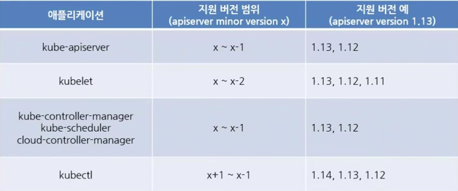

# Kubernetes version update

- 패키지마다 모든 컴포넌트는 동일한 버전으로 배포
    - apiserver, controller manager, scheduler, kubelet, kubeproxy 등.
    - 따라서 master server를 업데이트 했다면,  자동으로 update가 됨.
    - ETC, network plugin, CoreDNS는 제외

<p align="center"></p>

- 주의할점은 apiser를 기준으로 호환성을 제공.
- 그래서 1.12 에서 1.14로 업데이트를 하고싶은 경우, 1.13을 한번 거쳐서 동작이 제대로 수행되는지 확인 후 1.14로 넘어가는게 맞음.
- 즉, 마이너 버전이 업데이트를 해야할 경우, 하나씩 업데이트 되도록 하는 것이 좋음.

## 업데이트 방법
```shell
kubectl drain master

ssh master # master로 접속
$ sudo apt get upgrade -y kubeadm=1.17.3
$ sudo apt get upgrade -y kubelet=1.17.3
$ sudo kubeadm upgrade node config --kubelet-version v1.17.3
$ systemctl restart kubelt
$ exit

kubectl uncordon master
```