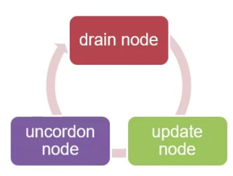

# Node 업그레이드

## 노드의 유지보수

<p align="center"></p>

- 노드를 재부팅 해야하는 경우(커널 업그레이드, libc 업그레이드, 하드웨어 복구 등)
- pod은 노드가 내려가서 5분 이상 돌아오지 않으면 그 때 다른 노드에 pod를 복제.
- 노드를 계획성 있게 내리는 방법이 중요.

### Drain Node

- 노드에 있는 pod들을 내리는 역할
- cordon이라는 명령이 같이 실행되고 벽을 친다고 생각하면 됨.
- 안에 있는 pod이 밖으로 나가거나, 밖에 있는 pod이 안으로 들어올 수 없게 됨.
- drain은 스케쥴링된 pod를 다른 노드로 리스케쥴링하고, 저지선을 만들어 현재 노드에 새로운 pod가 만들어지지 않도록 함.
- cordon은 저지선만 설치하는 것으로, 현재 갖고 있는 pod를 그대로 유지하면서 새로운 pod에 대해서만 스케쥴링을 거부.

### Update Node

- 노드를 업데이트

### Uncordon Node

- cordon을 해제하고, pod들이 다시 들어오게하여 프로세스가 정상적으로 동작하게 함.

ps. 사실상 drain을 하여 다른 node에 스케쥴링이 되었다면, uncordon을 하더라도 그 pod들이 되돌아오는 것은 아님. 다만 다른 node의 resource가 부족하여 pending된 상태의 pod들은
uncordon이 되면 스케쥴 가능한 node가 생기는 것이므로 되돌아 오는 것으로 볼 수 있음.

```bash
kubectl get node
# NAME                                       STATUS   ROLES    AGE   VERSION
# gke-cluster-1-default-pool-62166d37-068e   Ready    <none>   8d    v1.19.9-gke.1400
# gke-cluster-1-default-pool-62166d37-13vl   Ready    <none>   8d    v1.19.9-gke.1400
# gke-cluster-1-default-pool-62166d37-xzv0   Ready    <none>   8d    v1.19.9-gke.1400

kubectl drain gke-cluster-1-default-pool-62166d37-068e --ignore-daemonsets

kubectl get node
# NAME                                       STATUS                     ROLES    AGE   VERSION
# gke-cluster-1-default-pool-62166d37-068e   Ready,SchedulingDisabled   <none>   8d    v1.19.9-gke.1400
# gke-cluster-1-default-pool-62166d37-13vl   Ready                      <none>   8d    v1.19.9-gke.1400
# gke-cluster-1-default-pool-62166d37-xzv0   Ready                      <none>   8d    v1.19.9-gke.1400

kubectl get pod -o wide
# NAME                      READY   STATUS    RESTARTS   AGE     IP         NODE                                       NOMINATED NODE   READINESS GATES
# http-go-568f649bb-2hc6m   1/1     Running   0          6m12s   10.4.0.7   gke-cluster-1-default-pool-62166d37-xzv0   <none>           <none>
# http-go-568f649bb-5wvbx   1/1     Running   0          4m58s   10.4.0.8   gke-cluster-1-default-pool-62166d37-xzv0   <none>           <none>
# http-go-568f649bb-6hj2v   1/1     Running   0          4m58s   10.4.1.9   gke-cluster-1-default-pool-62166d37-13vl   <none>           <none>
# http-go-568f649bb-6q7pn   1/1     Running   0          6m12s   10.4.1.6   gke-cluster-1-default-pool-62166d37-13vl   <none>           <none>
# http-go-568f649bb-d4q6m   1/1     Running   0          4m59s   10.4.1.8   gke-cluster-1-default-pool-62166d37-13vl   <none>           <none>
# http-go-568f649bb-d9v9b   1/1     Running   0          6m12s   10.4.1.5   gke-cluster-1-default-pool-62166d37-13vl   <none>           <none>
# http-go-568f649bb-jvl95   1/1     Running   0          6m12s   10.4.0.4   gke-cluster-1-default-pool-62166d37-xzv0   <none>           <none>
# http-go-568f649bb-lbs8b   1/1     Running   0          6m12s   10.4.0.6   gke-cluster-1-default-pool-62166d37-xzv0   <none>           <none>
# http-go-568f649bb-ldrjv   1/1     Running   0          6m12s   10.4.0.5   gke-cluster-1-default-pool-62166d37-xzv0   <none>           <none>
# http-go-568f649bb-zb8vf   1/1     Running   0          6m12s   10.4.1.4   gke-cluster-1-default-pool-62166d37-13vl   <none>           <none>
```

- drain 이후에 node를 조회하면 SchedulingDisabled 된 것을 확인할 수 있음.
- 이 상태에서는 pod들은 해당 node를 제외한 node에만 스케쥴링이 되게 됨.

```bash
kubectl uncordon gke-cluster-1-default-pool-62166d37-068e

kubectl get node 
# NAME                                       STATUS   ROLES    AGE   VERSION
# gke-cluster-1-default-pool-62166d37-068e   Ready    <none>   8d    v1.19.9-gke.1400
# gke-cluster-1-default-pool-62166d37-13vl   Ready    <none>   8d    v1.19.9-gke.1400
# gke-cluster-1-default-pool-62166d37-xzv0   Ready    <none>   8d    v1.19.9-gke.1400

kubectl get pod -o wide
# NAME                      READY   STATUS    RESTARTS   AGE     IP         NODE                                       NOMINATED NODE   READINESS GATES
# http-go-568f649bb-2hc6m   1/1     Running   0          9m2s    10.4.0.7   gke-cluster-1-default-pool-62166d37-xzv0   <none>           <none>
# http-go-568f649bb-5wvbx   1/1     Running   0          7m48s   10.4.0.8   gke-cluster-1-default-pool-62166d37-xzv0   <none>           <none>
# http-go-568f649bb-6hj2v   1/1     Running   0          7m48s   10.4.1.9   gke-cluster-1-default-pool-62166d37-13vl   <none>           <none>
# http-go-568f649bb-6q7pn   1/1     Running   0          9m2s    10.4.1.6   gke-cluster-1-default-pool-62166d37-13vl   <none>           <none>
# http-go-568f649bb-d4q6m   1/1     Running   0          7m49s   10.4.1.8   gke-cluster-1-default-pool-62166d37-13vl   <none>           <none>
# http-go-568f649bb-d9v9b   1/1     Running   0          9m2s    10.4.1.5   gke-cluster-1-default-pool-62166d37-13vl   <none>           <none>
# http-go-568f649bb-jvl95   1/1     Running   0          9m2s    10.4.0.4   gke-cluster-1-default-pool-62166d37-xzv0   <none>           <none>
# http-go-568f649bb-lbs8b   1/1     Running   0          9m2s    10.4.0.6   gke-cluster-1-default-pool-62166d37-xzv0   <none>           <none>
# http-go-568f649bb-ldrjv   1/1     Running   0          9m2s    10.4.0.5   gke-cluster-1-default-pool-62166d37-xzv0   <none>           <none>
# http-go-568f649bb-zb8vf   1/1     Running   0          9m2s    10.4.1.4   gke-cluster-1-default-pool-62166d37-13vl   <none>           <none>

```

- uncordon을 진행하면 SchedulingDisabled가 해제되었으나, 기존에 스케쥴링된 pod들이 다시 되돌아오지는 않는 것을 확인.