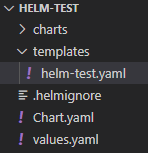

# Chart

- Helm의 패키지 포맷.
- 하나의 어플리케이션을 설치하기 위한 파일들로 구성.

## 디렉토리 구조

<p align="center"></p>

```bash
helm create helm-test
```

- chart의 템플릿 디렉토리는 위 명령어 실행으로 생성 가능.

## Chart.yaml

- 작성한 helm chart에 대한 버젼이나, 작성자, 차트 이름과 같은 메타 정보를 기록.
- helm chart 내에는 2가지 version이 존재
    - version: helm chart 자체 버젼
    - appVersion: 배포할 어플리케이션의 버젼

```yaml
apiVersion: v1
appVersion: "1.0"
description: "helm test yaml"
name: helm-test
version: 0.1.0
```

## requirement.yaml

- 현재 helm chart를 설치하기 위해 필요한 chart 들을 기록, 즉 의존성을 정의.
- 여기에 기록된 chart들은 현재 chart가 설치되기 전에 자동으로 설치가 진행.

```yaml
dependencies:
  - name: apache
    version: 1.2.3
    repository: http://example.com/charts
  - name: mysql
    version: 3.2.1
    repository: http://another.example.com/charts
```

## etc

- helm chart의 정의는 templates 폴더 아래 배치.
- 작성한 템플릿들의 value들은 main root의 values.yaml에 정의.

### Template & Value

- Helm은 기본적으로 템플릿을 만들고 벨류를 채워넣어 쿠버네티스에서 사용하는 yaml을 만듬.

```yaml
apiVersion: apps/v1beta2
kind: Deployment
metadata:
  name: helm-{{ .Values.name }}-deployment
spec:
  replicas: { { .Values.replicaCount } }
  selector:
    matchLabels:
      app: { { .Values.name } }
  template:
    metadata:
      name: { { .Values.name } }-pod
      labels:
        app: { { .Values.name } }
    spec:
      containers:
        - name: { { .Values.name } }-container
        images: helm-test
        ports:
          - containerPort: 8080
---
apiVersion: v1
kind: Service
metadata:
  name: helm-{{ .Values.name }}-svc
spec:
  selector:
    app: { { .Values.name } }
  ports:
    - name: http
    port: 80
    protocol: TCP
    targetPorts: 8080
  type: LoadBalancer
```

```yaml
name: "hello-world"
replicaCount: 3
```