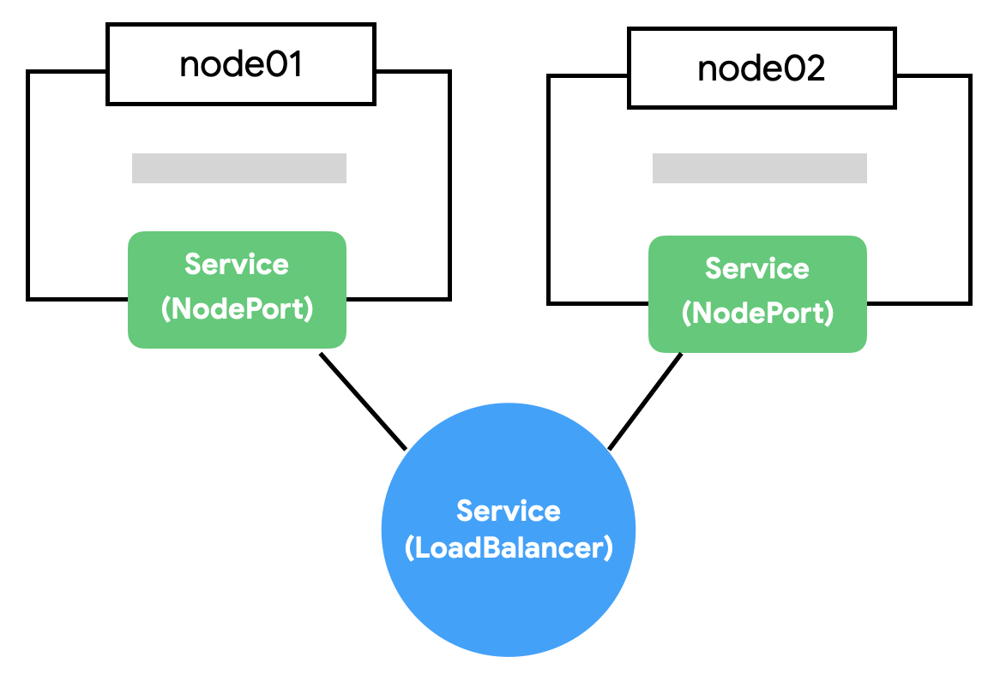

# Service

- pod은 자체 ip를 가지고 있지만, 생성과 소멸을 반복하기에 고정된 end-point로 호출하기 어려움.
- 여러 pod에서 같은 어플리케이션을 동작하는 경우, pod간의 로드밸런싱을 지원해야 줘야 한쪽에 부하가 걸리지 않음.
- Service는 지정된 ip로 생성과 로드밸런싱이 가능하며, 고유한 DNS를 가질 수 있음.
- 또한 멀티포트를 지원하여, 여러개의 포트를 동시에 지원 가능.

```yaml
ports:
  - name: http
  port: 80 # 서비스를 제공할 포트
  protocol: TCP
  targetPort: 8080 # pod의 포트
  - name: https
  port: 443
  protocol: TCP
  targetPort: 8082
```

## Service 흐름

<p align="center"></p>

1. `Endpoint Controller`는`Service`와`Pod`을 감시하면서 조건에 맞는 Pod의 IP를 수집
2. `Endpoint Controller`가 수집한 IP를 가지고`Endpoint`생성
3. `Kube-Proxy`는`Endpoint`변화를 감시하고 노드의 iptables을 설정
4. `CoreDNS`는`Service`를 감시하고 서비스 이름과 IP를`CoreDNS`에 추가

> iptable은 커널 레벨의 네트워크 도구 CoreDNS는 클러스터 내부용 DNS EndPoint는 서비스의 접속 정보를 가짐.

## Deployment YAML

```yaml
apiVersion: apps/v1
kind: Deployment
metadata:
  name: redis
spec:
  selector:
    matchLabels:
      app: redis
      tier: db
  template:
    metadata:
      name: redis
      label:
        app: redis
        tier: db
    spec:
      - containers:
        name: redis-container
        image: redis
        ports:
          - containerPort: 6379
            protocol: TCP

---

apiVersion: v1
kind: service
metadata:
  name: redis-svc
spec:
  ports:
    - port: 6379 # 서비스가 생성할 포트
      protocol: TCP
  selector: # 서비스가 접근할 pod의 label
    app: redis
    tier: db
```

- service의 selector를 통해 관리하고자 하는 pod을 지정 가능.

```bash
kubectl apply -f redis-svc.yml

# Pod, ReplicaSet, Deployment, Service 상태 확인
kubectl get service

# NAME                 TYPE        CLUSTER-IP      EXTERNAL-IP   PORT(S)    AGE
# service/kubernetes   ClusterIP   10.96.0.1       <none>        443/TCP    3d19h
# service/redis        ClusterIP   10.103.50.102   <none>        6379/TCP   10s
```

```yaml
apiVersion: v1
kind: Deployment
metadata:
  name: counter
spec:
  selector:
    matchLabels:
      app: counter
      tier: app
  template:
    metadata:
      labels:
        app: counter
        tier: app
    spec:
      containers:
        - name: counter-container
        image: ghcr.io/subicura/counter:latest
        env:
          - name: REDIS_HOST
          value: "redis"
          - name: REDIS_PORT
          value: "6379"        
```

- 서비스의 세션 고정
    - 처음 접속한 client ip에 계속 접속해서 하나의 pod에만 접속하여, session을 유지 가능.
    - Pod이 여러 개일 경우, 각각의 pod에 각각 인증을 해야되는 상황을 피하기 위해.

```yaml
    spec:
      sessionAffinity: ClientIP
  ```

## Service의 종류

Service는 ip 할당 방식과 연동 서비스에 따라 크게 4가지로 나뉨

1. Cluster IP
2. Load Balancer
3. Node IP
4. External Name

### 1. Cluster IP

- 디폴트 설정.
- Service에 클러스터 ip(내부 ip)를 할당하고, pod을 바라보는 load balancer 기능 제공.
- 서비스 이름을 내부 도메인으로 등록하여 pod간 서비스 이름으로 통신.
- 클러스터 외부에서는 접근 불가.

### 2. Node Port

<p align="center"></p>

- Cluster IP는 클러스터 내부에서만 접근 가능.
- 클러스터 ip 뿐만이 아니라 모든 노드의 ip와 port를 통해서도 접근이 가능.
- 외부에 접속시킬 수 있게하는 node port.
- 30000-32767 포트만 사용 가능.

```yaml
apiVersion: v1
kind: Service
metadata:
  name: counter-np
spec:
  type: NodePort
  ports:
    - port: 3000 # 서비스의 포트
      protocol: TCP
      targetPort:
        8080: # 포드의 포트
      nodePort: 31000 #최종적으로 서비스되는 포트
  selector:
    app: counter
    tier: app
```

- 31000에 접속하면 내부에 kube-proxy에 연결되고, round-robin방식으로 적절한 pod 포트에 연결해줌.
- node port는 클러스터의 모든 노드에 포트를 오픈.
- node port는 cluster ip의 기능을 포함.

### 3. Load Balancer

<p align="center"></p>

- Node port의 경우 여러개의 노드 중 어느것으로 접속해도, node port에 접속할 수 있지만 어떤 노드가 살아있는지 알 수 없음.
- 이런 경우, 죽은 노드를 통해서는 node port로 접근 불가.
- 자동으로 살아있는 노드로 접속하기 위해선, 이런 노드들을 바라보고 있는 Load balancer가 필요.
- Load balancer에게 요청을 전달하고, load balancer가 알아서 살아있는 노드에 접근하면 이런 단점이 해결.
- Load balancer는 node port의 기능을 포함.

```yaml
apiVersion: v1
kind: Service
metadata:
  name: counter-lb
spec:
  type: LoadBalancer
  ports:
    - port: 30000
      targetPort: 3000
      protocol: TCP
  selector:
    app: counter
    tier: app
```

### 4. External Name

- 외부 서비스를 쿠버네티스 내부에서 호출하고자 할 때 사용하는 방법.
- 클러스터 내 pod들은 내부 ip를 가지고 있어 클러스터 ip 대역 밖의 서비스 호출에는 복잡한 설정이 필요.
- AWS나 GCP와 같은 클라우드 환경이 제공하는 데이터베이스, 매니지드 서비스등을 사용하고자 할 때 사용할 수 있는 방법이 External name

```yaml
apiVersion: v1
kind: Service
metadata:
  name: external-name-svc
  namespace: prod
spec:
  type: ExternalName
  externalName: my.database.example.com
```

- spec에 `ExternalName`을 선언하고 주소를 DNS로 externalName에 설정해주면, external-name-svc로 들어오는 모든 요청을 externalName에 해당하는 곳으로 포워딩 해줌.
  (proxy와 같은 역할)

### DNS가 아닌 직접 IP를 사용하는 경우

<p align="center"></p>

```yaml
apiVersion: v1
kind: Service
metadata:
  name: external-svc-nginx
spec:
  ports:
    - port: 80
```

```yaml
apiVersion: v1
kind: EndPoints
metadata:
  name: external-svc-nginx
subsets:
  - address: 35.225.75.124
  ports:
    - port: 80
```

- 서비스를 cluster ip로 생성하고 서비스에 속하는 pod을 지정해주지 않음.
- 추가적으로 서비스의 EndPoints를 별도로 지정.
- 이때 service name과 endpoints의 이름은 반드시 같아야함.