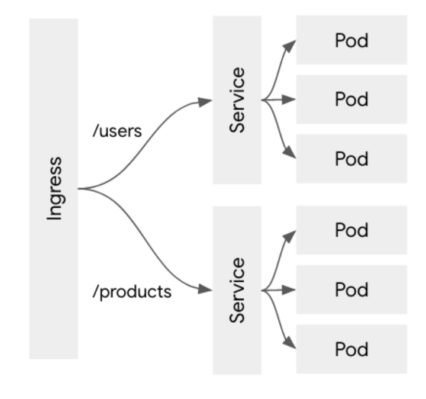

# Ingress

<p align="center"></p>

- 쿠버네티스의 서비스는 L4 레이어로 TCP단에서 pod를 밸런싱.
- 호스트 명, url에 따른 서비스간 라우팅이 불가.
- 이런 경우 L7 로드밸런서로 위의 문제를 해결하게 됨.
- 인그레스는 서비스 앞에서 L7 로드밸런서 역할을 하고, url에 따른 라우팅을 함.
- 여러 구현체가 존재하며 GCP의 글로벌 로드밸런서, nginx를 이용해 ingress 역할을 만들 수 있음.

## URL path 기반 라우팅

- GCP의 글로벌 로드밸런싱 기능 예시.
- /users 와 /products 서비스에 대한 Ingress 사용.
- Ingress 사용 시, load balancer type이 아닌 node port type을 사용해야 함.
- Deployment 는 제외하고 service만 작성 함.

```yaml
apiVersion: v1
kind: Service
metadata:
  name: users-node-svc
spec:
  type: NodePort
  selector:
    app: users
  ports:
    - name: http
    port: 80
    targetPort: 8080
    protocol: TCP
```

```yaml
apiVersion: v1
kind: Service
metadata:
  name: products-node-svc
spec:
  type: NodePort
  selector:
    app: products
  ports:
    - name: http
    port: 80
    targetPort: 8080
    protocol: TCP
```

- spec의 ports에 기존 node port 설정 때의 nodePort를 지정해 주지 않았는데, 쿠버네티스 클러스터 자동으로 지정해 줌.
- Node port를 사용한 이유는 GCP에서 Ingress로 사용되는 load balancer의 경우, 각 서비스의 상태 체크를 위해서 노드에 대해 nodeport로 heartbeat 체크를하고 문제가 있는
  노드를 자동으로 제거하거나 복구하기 때문.

```yaml
apiVersion: extenstions/v1beta
kind: Ingress
metadata:
  name: ingress-test
spec:
  rules:
    - http:
    paths:
      - path: /users/*
      backend:
        serviceName: users-node-svc
        servicePort: 80
      - path: /products/*
      backend:
        serviceName: products-node-svc
        servicePort: 80
```

- user service는 /users/* URI 인 경우 users-node-svc로 라우팅 해줌.
- service port는 cluster ip의 port를 설정.
- GCP load balancer를 이용하는 경우, node port로 통신을 하지만 별도로 지정하지 않고 GCP에서 자동으로 해당 서비스의 nodeport에 맵핑 됨.

## Static IP 지정하기

- gcloud 명령을 통해 static ip를 생성할 수 있음.
- ip는 regional 또는 global로 생성할 수 있으며, ingress는 global ip를 사용 가능.
- global ip 에서는 망 가속 기능을 통해, 가장 가까운Point of Presence(Pop)을 통해 구글 클라우드 전용 네트워크를 이용하여, 일반 인터넷보다 빠른 성능을 낼 수 있음.

```bash
gcloud compute addresses create ingress-static-ip --global
```

- 생성된 static ip를 확인 하고 ingress yaml를 작성.

```yaml
apiVersion: extensions/v1beta
kind: Ingress
metadata:
  name: ingress-static-test
  annotations:
    kubernetes.io/ingress.global-static-ip-name: "ingress-static-ip"
spec:
  rules:
    - http:
        paths:
          - path: /users/*
            backend:
              serviceName: users-node-svc
              servicePort: 80
          - path: /products/*
            backend:
              serviceName: products-node-svc
              servicePort: 80
```