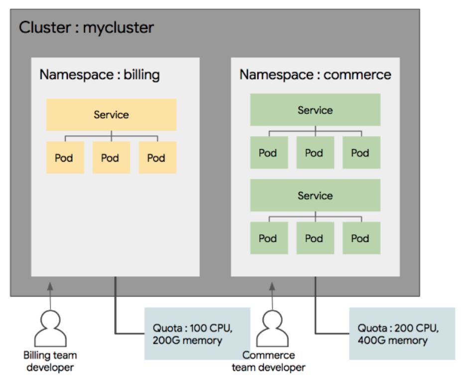

# Namespace

- 쿠버네티스 클러스터내의 논리적인 분리 단위.
- Pod, service 등은 네임스페이스별로 생성이나 관리.
- 사용자 권한 역시 네임스페이스별로 나눠서 부여 가능.
    - 하나의 클러스터 내, 개발/운영/테스트 3개의 환경이 있을 경우, 네임스페이스를 통해 3개로 나눠서 운영 가능.
- 사용자별 네임스페이스 접근 권한을 다르게 설정할 수 있음.
- 네임스페이스 별로 리소스 Quota(할당량, 사용량)을 지정할 수 있음.
- 네임스페이스 별로 object를 나눠서 관리할 수 있음(Pod, service 등)

- 주의할 점
    - 말그대로 논리적인 분리 단위이기 때문에, 다른 네임스페이간 통신이 가능.
    - 따라서 높은 수준의 분리 정책을 원한다면 클러스터를 분리하는게 맞음.

<p align="center"></p>

## Create namespace

```yaml
apiVersion: v
kind: Namespace
metadata:
  name: test-namespace
```

또는

```bash
kubectl create ns [namespace-name]

kubectl create ns [namespace-name] --dry-run -o yaml > create_ns.yaml
# dry run 결과를 yaml 형태로 출력하고 이를 저장.
# 이후 kubectl create를 통해 실행.
```

## namespace 명령어

```bash
kubectl get ns # 기본 namspace 확인

kubectl get po --namespace kube-system # 특정 namespace에 pods들을 가져옴
# kubectl get [objects] --namespace [namespace-name]

kubectl get po --all-namespaces # 전체 namespace 가져오기

kubectl create deploy busybox --image busybox --n office #특정 namespace로 실행
# kubectl create deploy image-name --image [image-source] --n [namespace-name]

kubectl get all -n office # 특정 namespace로 만든 object들 확인.
# kubectl get [objects] -n [namespace-name]

kubectl delete ns office # office namespace 삭제
# namespace를 삭제하면 할당받은 object들도 사라짐.
```

# Label

- 쿠버네티스의 리소스를 선택하는데 이용.
- 각 리소스는 라벨을 가질 수 있고, 특정 라벨을 가진 리소스만을 선택하여 사용할 수 있음. ex) 특정 라벨을 가진 리소스만을 배포, service에 연결, 네트워크 접근 권한 부여.
- metadata 섹션에 key:value 형태로 정의 가능하며, 여러 개의 라벨을 동시에 적용 가능
- Label 배치 전략 확인!

[9 Best Practices and Examples for Working with Kubernetes Labels](https://www.replex.io/blog/9-best-practices-and-examples-for-working-with-kubernetes-labels)

```yaml
metadata:
  label:
    app: ui
    rel: beta
```

- 라벨을 활용하는 방법 → Selector!
- Selector는 yaml의 object spec에서 selector를 정의하고 라벨 조건을 적으면 됨.
- Equality based selector
    - 같냐, 다르냐 같은 조건을 이용하여 리소스를 선택하는 방법
    - key1 = value1, key2 != value2
- Set based selector
    - 집합의 개념을 이용
    - environment in (qa, production) → environment가 qa 또는 production인 경우
    - tier notin (frontend, backend) → tier가 frontend도 backend도 아닌 경우.

```yaml
kind: Service
spec:
  selector:
    app: myapp # pod의 라벨 app이 myapp인 경우만 선택하여 service
```