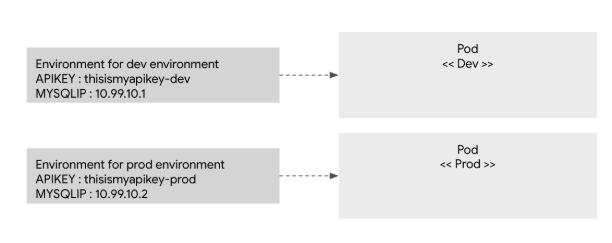

# ConfigMap

<p align="center"></p>

- 어플리케이션 이미지는 같지만, 환경 변수가 다른 경우 사용.
    - ex) 데이타베이스의 ip, API를 호출하기 위한 api key, 개발/운영에 따른 디버그 모드, 환경 설정 파일 등.
- 환경 변수나 설정 값등을 변수로 관리하여, pod가 생성될 때 값을 넣어주는 역할.
- 정의해 놓은 값을 pod에 넣어 주는 방법은 크게 두가지.
    - 환경 변수로 넘기는 방법
    - 디스크 볼륨으로 마운트 하는 방법
- 설정 정보를 저장해두는 일종의 저장소
- key-value 형식으로 저장
- ConfigMap을 생성하는 방식은 크게 literal과 file.

## Literal

```bash
kubectl create configmap hello-cm --from-literal=language=java
```

```yaml
apiVersion: v1
kind: ConfigMap
metadata:
  name: hello-cm
data:
  language: java
```

- 위 두개는 같은 config map을 생성.

```yaml
apiVersion: apps/v1
kind: Deployment
metadata:
  name: cm-deployment
spec:
  replicas: 3
  selector:
    matchLabels:
      app: cm-literal
  template:
    metadata:
      name: cm-literal-pod
      labels:
        app: cm-literal
    spec:
      containers:
        - name: cm-literal-container
        image: cm-literal-image
        ports:
          - containerPort: 8080
        env:
          - name: LANGUAGE
          valueFrom:
            configMapKeyRef:
              name: hello-cm
              key: language
```

- 컨테이너에서 실행되는 코드 내 사용할 환경 변수의 이름을 deployment 작성 시 configmap과 함께 추가 ( 아래 예시에서는 LANGUAGE)

## File

### 환경변수로 전달.

- Literal을 통해 개별적인 값으로 전달도 가능하지만, 파일 형태로 전달하는 것도 가능.

```text
myname=brettahn
email=brettahn@brett.com
address=seoul
```

```bash
kubectl create configmap cm-file --from-file=profile.properties
```

```yaml
apiVersion: apps/v1
kind: Deployment
metadata:
  name: cm-deployment
spec:
  replicas: 3
  selector:
    matchLabels:
      app: cm-file
  template:
    metadata:
      name: cm-file-pod
      labels:
        app: cm-file
    spec:
      containers:
        - name: cm-file-container
        image: cm-file-image
        ports:
          - containerPort: 8080
        env:
          - name: PROFILE
          valueFrom:
            configMapKeyRef:
              name: cm-file
              key: profile.properites
```

- 파일로 읽어올 경우 `PROFILE`이라는 환경 변수에 `profile.properties`에서 읽어온 내용을 저장.
- 이때 주의해야 하는점은 `profile.properites`의 내용이 key-value형태를 취하고 있지만, 개개별 key-value로 인식하는 것이 아닌, 문자열로 처리

<p align="center"></p>

### 디스크 볼륨에 마운트

```yaml
apiVersion: apps/v1
kind: Deployment
metadata:
  name: cm-deployment
spec:
  replicas: 3
  selector:
    matchLabels:
      app: cm-volume
  template:
    metadata:
      name: cm-volume-pod
      labels:
        app: cm-volume
    spec:
      containers:
        - name: cm-volume-container
        image: cm-volume-image
        ports:
          - containerPort: 8080
        volumeMounts:
          - name: config-profile
          mountPath: /tmp/config
      volumes:
        - name: config-profile
        configMap:
          name: cm-file
```

- 볼륨 정의시 configMap으로 정의하고, 그 이름을 cm-file로 정의하여 cm-file configMap을 선택하게 함.
- /tmp/config의 위치에 configMap을 마운트

# Secret

- ConfigMap이 일반적인 환경 설정등을 저장한다면, secret은 보안이 중요한 비밀번호나, api key, 인증서 등을 저장.
- secret 내부에 저장된 데이터는 추가적인 보안기능을 제공.
- 한개의 secret은 1M까지의 사이즈가 지원되며, 메모리를 사용.
- 메모리를 사용하기 때문에, 너무 많은 secret의 생성은 메모리 사용량을 늘려 out of memory issue를 발생시킬 수 있으니 주의.

```yaml
apiVersion: v1
kind: Secret
metadata:
  name: secret-test
data:
  language: amF2YQo=
```

- 사용법은 configmap과 동일하지만 값에 해당하는 부분을 base64 포맷으로 인코딩 해야함.
- 이유인 즉, SSL 인증서와 같은 바이너리 파일은 문자열 저장이 불가능하기 때문에, 이를 지원하기 위해 base64 인코딩을 지원.
- 환경변수나 볼륨 마운트를 통해 읽는 경우 디코딩되어 읽힘.