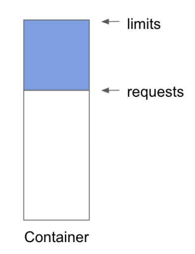
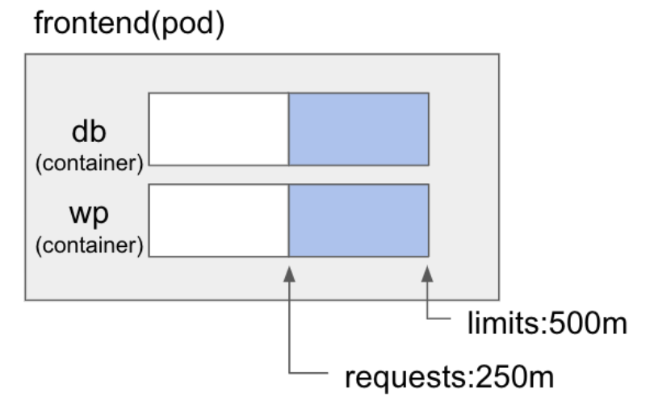

# Resource Allocation

- 쿠버네티스는 컨테이너가 필요한 리소스 양을 명시할 수 있음.
- 리소스의 단위
    - CPU: ms, 대략 1000ms가 1 vCore.
    - 메모리: mb.
- Request & Limit
    - Request: 컨테이너가 생성될 때 요청하는 리소스 양.
    - Limit: 생성 후, 추가 리소스가 필요한 경우 사용할 수 있는 최대 값.

<p align="center"></p>
<p align="center"></p>

```yaml
apiVersion: v1
kind: Pod
metadata:
  name: request-limit-test
spec:
  containers:
    - name: db
    image: mysql
    resources:
      requests:
        memory: "64Mi"
        cpu: "250m"
      limits:
        memory: "128Mi"
        cpu: "500m"
    - name: wp
    image: wordpress
    resources:
      requests:
        memory: "128Mi"
      limits:
        memory: "256Mi"
```

## 리소스 모니터링

```bash
kubectl describe nodes # node 상세정보
kubectl top nodes # 실제 node에서 사용되고 있는 resource 정보
kubectl top pods # pod에서 사용되고 있는 resource 정보
```

- describe nodes 에서 확인한 request resource와 top으로 확인하는 실제 resource의 양은 차이가 있음.

## Resource Quota

- namespace별 사용 가능한 resource의 양을 정하는 것

```yaml
apiVerson: v1
kind: ResourceQuota
metadata:
  name: quota-example
spec:
  hard:
    requests.cpu: 500m
    requests.memory: 100Mib
    limits.cpu: 1000m
    limits.memory: 500Mib
```

- spec.hard에 정의된 resource 내에서 quota-example namespace가 컨테이너를 만들어 사용 가능.

## Limit Range

- Resource Quota가 namespace 전체라면, Limit Range는 개별 컨테이너의 resource의 범위를 지정

```yaml
apiVersion: v1
kind: LimitRange
metadata:
  name: limit-range-example
spec:
  limits:
    - default:
      cpu: 600m
      memory: 100Mib
    defaultRequest:
      cpu: 100m
      memory: 50Mib
    min:
      cpu: 10m
      memory: 10Mib
    max:
      cpu: 1000m
      memory: 200Mib
    type: Container
```

- default는 limit이 지정되지 않았을 경우, 지정되는 limit.
- defaultRequest는 request가 지정되지 않았을 경우, 지정되는 request.
- min은 limit을 지정할 경우, 지정 가능한 최소 크기.
- max는 limit을 지정할 경우, 지정 가능한 최대 크기.

### Overcommitted

- request의 정의에 따라 컨테이너가 생성되더라도, 자원이 모자르게되면 limit에 정의된 양 만큼 리소스를 요청하게 됨.
- 그러다보면 시스템이 가용한 resource보다 limit에 정의된 resource가 커지는 상황이 생기는데, 이를 overcommitted 상태라고 함.
- 이 상태가 되면, 실제 사용량을 request에 정의된 상태까지 낮추게 되고, 그래도 해결되지 않는 경우 우선순위에 따라 컨테이너를 강제 종료시킴.
- 메모리의 경우 사용 중인 메모리를 줄일 수 없기 때문에 컨테이너를 강제 종료 시키고, ReplicaSet이나 Deployment에 관리되고 있는 컨테이너는 request만큼 resource를 할당받고 재시작 함.

### Best practice

- 데이터베이스 등의 무거운 어플리케이션이 아닌 경우에는 cpu request는 100m 이하로 권장.
- 세밀한 클러스터 운영이 어려운 경우 request와 limit을 같게하는 걸 권장.
- overcommit되면 실제 필요한 cpu 크기보다 작은 cpu크기로 줄어들기 때문에 성능저하 발생.
- [Kubernetes requests vs limits: Why adding them to your Pods and Namespaces matters | Google Cloud Blog](https://cloud.google.com/blog/products/containers-kubernetes/kubernetes-best-practices-resource-requests-and-limits)