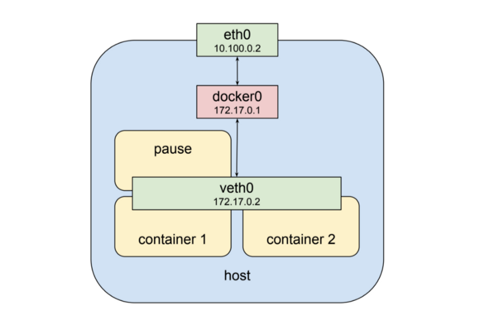
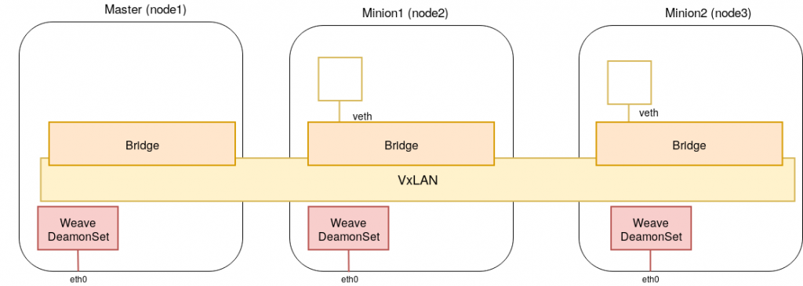
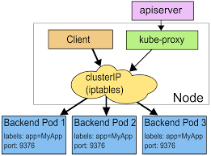
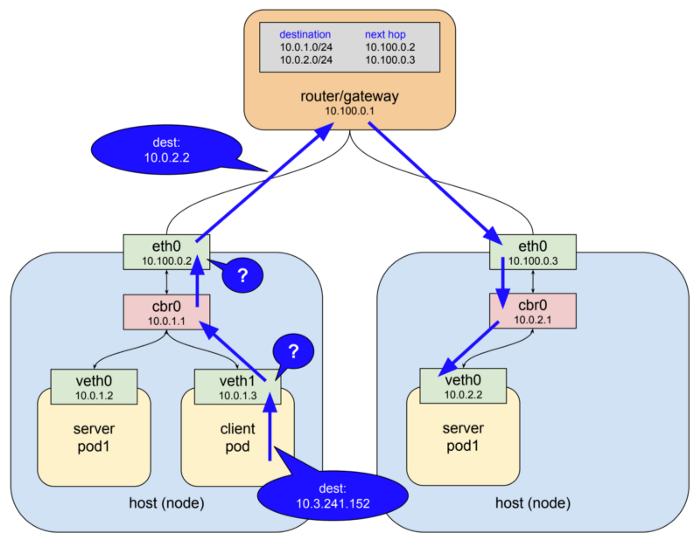
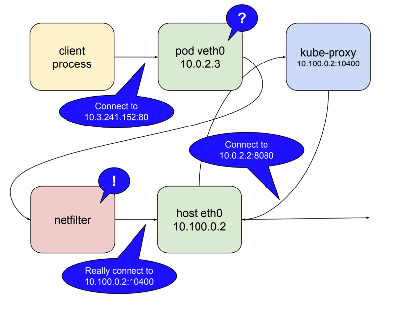
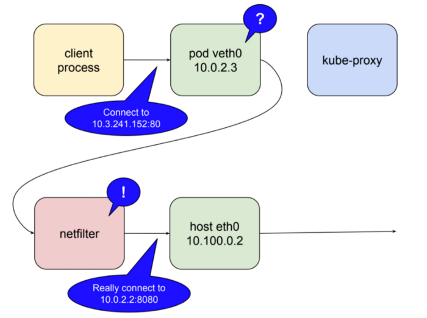

# Kubernetes network model

- 한 포드에 있는 다수의 컨테이너간의 통신
- 포드끼리의 통신
- 포드와 서비스 사이의 통신
- 외부 클라이언트와 서비스 사이의 통신

## 한 포드에 있는 다수의 컨테이너간의 통신

- veth0이라는 인터페이스를 두개의 컨테이너가 공유함.
- 동일한 네트워크를 사용하기에 당연히 port를 겹치게 구성하면 안됨!
- 또한 pause라는 컨테이너가 존재하는데, 모든 pod마다 존재하며 공통 네트워크 인터페이스를 제공하는 역할을 담당.

## 포드 간의 통신

- 포드 간의 통신을 위해서는 CNI 플러그인이 필요.
- 기본적으로 kubenet이라는게 존재하지만, 제공 기능이 적어 외부 플러그인을 사용하는걸 추천.
- CNI 플러그인들은 개별적으로 지원하는 기능들이 다르기 때문에 다음 기능들을 확인하고 필요한 CNI 플러그인을 선택.
    - Network Model:
        - vxlan: 캡슐화된 네트워킹으로 이론적으로 속도가 느림.
        - layer2: 캡슐화되지 않은 네트워킹으로 오버헤드의 영향이 없음
    - Route Distribution:
        - 네트워크 세그먼트에 분할된 클러스트를 구축하려는 경우 사용.
        - 인터넷에 라우팅 및 연결 가능성 정보를 교환하도록 설계된 외부 게이트 프로토콜.
    - Network Policy:
        - 네트워크 정책을 사용하여 pod가 서로 통신할 수 있는 규칙을 적용
    - Mesh Networking:
        - 쿠버네티스 클러스터 간 pod to pod 네트워킹이 가능
        - pod간 순수한 네트워킹
    - Encryption
        - 네트워크 컨트롤 플레인을 암호화하여 모든 TCP 및 UDP 트래픽을 암호화
    - Ingress / Egress Policies:
        - 들어오거나 나가는 패킷에 대한 통신 제어

- [Kubernetes networks solutions comparison - Objectif Libre](https://www.objectif-libre.com/en/blog/2018/07/05/k8s-network-solutions-comparison/)

## 포드와 서비스 사이의 통신

- Pod은 수시로 교체되기 때문에 pod-to-pod 네트워크 만으로는 안정적이지 못함.
- 그래서 보통 service를 엔드포인트로 설정하고, service는 pod로 트래픽을 포워딩 해줌.
- Service는 pod로 액세스할 수 있는 정책을 정의하는 추상화된 개념으로 볼 수 있음.

- IP 네트워크는 기본적으로 자신의 host에서 목적지를 찾지 못하면 상위 게이트웨이로 패킷을 전달.
- 그렇게 최상위에 있는 게이트웨이까지 ip주소가 전달되지만, 초기의 dest와 다른 목적지 주소로 변경되어 패킷이 전달.
- 그 이유는 linux kernerl의 netfilter와 user space에 존재하는 iptables라는 소프트웨어를 통해 패킷의 흐름을 제어하기 때문.
- net filter에는 매칭되는 패킷을 발견하면 사전에 정의된 action을 수행하는데, 그 중 목적지의 주소를 변경할 수 있는 Destination NAT라는 action이 존재.
-

- 쿠버네티스는 netfilter를 proxy(Destination Proxy) 형태로 사용.
- 따라서 초기에 10.3.241.152:80이라는 service ip가 들어오면 패킷을 kube-proxy로 라우팅되도록 설정 함.
- netfilter에서 들어온 ip를 확인하고 이를 kube-proxy로 보내고, kube-proxy는 이에 해당하는 실제 목적지를 전달.

- 하지만 iptables mode가 생김으로써, kube-proxy의 역할을 담당하고 실제 pod에 전달하는 것 조차 netfilter가 담당.
- kube-proxy는 netfilter의 규칙을 수정하는 것을 담당.

## 참고

- [쿠버네티스(Kubernetes) 네트워크 정리](https://medium.com/finda-tech/kubernetes-%EB%84%A4%ED%8A%B8%EC%9B%8C%ED%81%AC-%EC%A0%95%EB%A6%AC-fccd4fd0ae6)