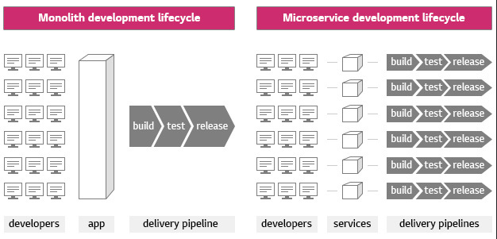

# Monolithic & MSA

- 어플리케이션이 많아지고 복잡해질 수록 테스트가 어려워 짐
- 네트워크로 통신하기 때문에 네트워크 레이턴시와 트래픽 증가
- 배포에 대한 자동화가 강제

## Monolithic architecture

- 전통적인 아키텍쳐
- 서비스가 하나의 어플리케이션으로 돌아가는 구조.
- 하나의 서비스 또는 어플리케이션이 하나의 아키텍쳐
- 다양한 기능을 동작하는 서비스를 서버에서 실행.
- 단점
    - Scaling 시, 어플리케이션을 그대로 복제하여 로드밸런싱, 불필요한 서비스까지 모두 복제.
    - 종속적인 라이브러리 충돌. 기능에 따른 라이브러리를 관리하기가 어려움.
    - 전체가 하나로 동작하기에, 작은 수정에도 전체 빌드하여 재배포.

## Micro Service Architecture(MSA)

- 어플리케이션의 각각의 기능을 분리하여 개발 및 관리.
- 서비스 단위 빠른 개발. 개발자 당 특정 비지니스 로직에만 집중하여 개발.
- 서비스 단위로 스케일링이 가능하기에 불필요한 서비스는 줄이고 필요한 서비스는 확장 가능.
- 라이브러리 종속성에 자유로움. (컨테이너라는 가상화 된 환경에서 구동되기에)
- 단점
    - 분산 시스템 환경에서 transaction 보장, 테스트, 배포, 관리가 복잡.
    - 어플리케이션이 많아지고 복잡해질 수록 테스트가 어려워 짐.
    - 네트워크로 통신하기 떄문에 네트워크 레이턴시와 트래픽 증가
    - 배포에 대한 자동화가 강제.

