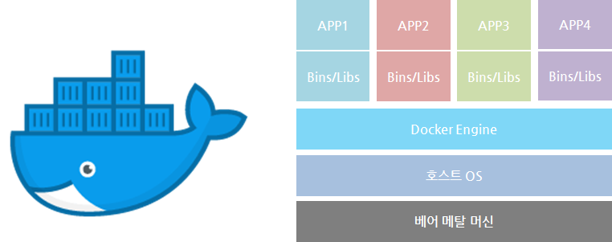
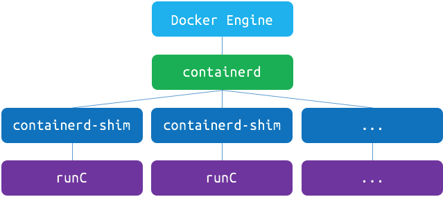
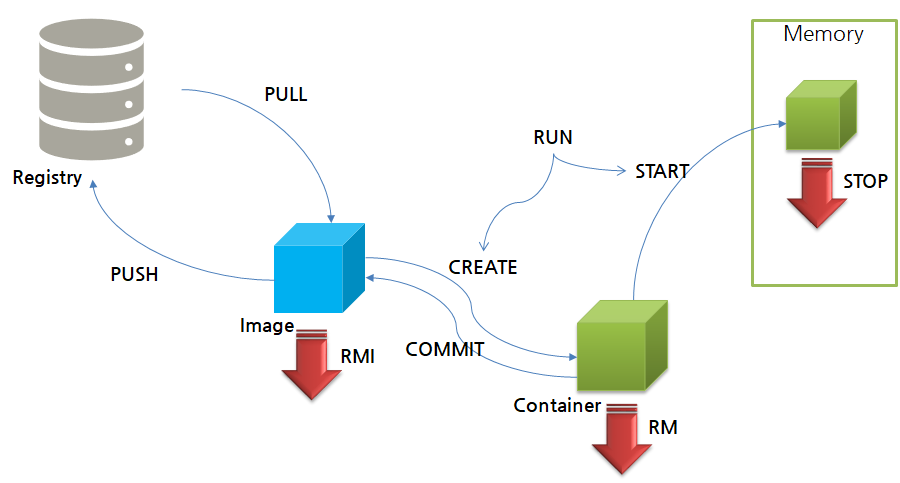
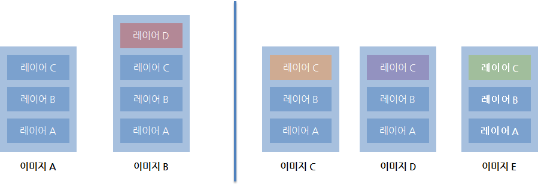

# Docker

<p align="center"></p>

## Container

- container는 가상머신을 사용해 각 MSA를 격리하는 기술.
- 하드웨어를 전부 구현하지 않기 때문에 빠른 실행 가능.
- 컨테이너를 격리하는 기술
    - Linux namespace :
      각 프로세스가 파일 시스템 마운트, 네트워크, 유저(uid), 호스트 네임(uts) 등에 대해 시스템에 독립적인 view를 제공.
    - Linux control group (cgroup) :
      프로세스로 소비할 수 있는 리소스 양을 제한. (CPU, 메모리, I/O, 네트워크 대역대, 디바이스 노드 등)

## Docker

- 다양한 운영체제에서 사용 가능하나. Linux의 기술을 사용하기에 Hypervisor를 사용해 사용해야 함.
- Image
    - 필요한 프로그램과 라이브러리, 소스를 설치한 뒤 만든 하나의 파일.
- Container
    - Image를 격리하여 독립된 공간에서 실행한 가상 환경.

<p align="center"></p>

- Docker engine : 이미지, 네트워크, 디스크 등의 관리 역할
- Containerd : OCI 구현체(runC)를 이용해 container를 관리해주는 daemon
- Containerd에서 나눠진 containerd-shim으로 나뉘어져 격리된 환경에서 돌아감.
- 두 프로그램은 개별적으로 돌아가기에 engine이 재시작해도 서비스는 그대로 유지시킬 수 있음.

- 단점 및 한계
    - 서비스가 커지면 커질 수록 관리해야 하는 container의 양이 급격히 증가!
      why? 컨테이너마다 개별적으로 프로그램이 돌아가니까!
    - 배포 및 컨테이너 배치 전략 필요.
    - Scale-in, Scale-out이 어려움.
    - 이를 보조할 수 있는 오케스트레이션(Orchestration)이 쿠버네티스.

## Docker life cycle

<p align="center"></p>

- Run시, Image가 존재한다면 가지고 있는 pull 없이 CREATE와 START만 실행.
- Run시, 주의할 점은 Run 실행 시마다 계속 container가 새롭게 생성 및 실행됨. 따라서 create가 필요한 경우에만 run을 사용하던지, create와 start 명령어를 따로 사용하는게 좋음.

## Image Layer의 개념

<p align="center"></p>

- Image A에서 작업을 진행하다가 필요에 따라, layer D를 추가한 Image B를 만들 수 있음.
- 이때 Image B를 push 하면 layer D 만 push 됨.
- layer A, B, C를 사용하는 Image B가 구동된 상태에서, Image A를 지우려해도 layer가 공유되어 사용 중이기에 지울 수 없음.

```bash
docker inspect nginx
```

- nginx를 예제로 layer의 개념을 살펴보자.
    - id는 image 가 가지는 hash 값. 겹치지 않는 값.
    - ExportedPorts는 서비스 되는 포트
    - Env에는 환경 변수 등록 상태.
    - cmd는 container로 바꿔서 실행했을 때 container 안에서 어떤 process를 돌릴지.
    - RootFS는 이름에서도 볼 수 있듯, 실제 File System을 구성해주는 부분. nginx는 6개의 layer를 볼 수 있음.
- 나는 window wsl에서 작업을 해서 확인할 수 없지만 강의에서 말하길
    - /var/lib/docker 내부 폴더의 image dir 안에는 image db 와 layer db가 있음.
    - image db에 대한 정보는 layer db가 가지고 있고,
    - layer db에 대한 정보는 다시 layer2 dir에 가지고 있음.
    - 하지만 실제론 layer2 dir에는 변경 사항이 저장되어 있음.
    - link 되어 있는걸 타고 들어가 보면 실제 file system이 있음.
    - 결국 실제 정보는 overlay2에 저장되어 있다고 볼 수 있음.

## Docker Cheat Sheet

[도커 기본 명령어](https://www.notion.so/13233f85eaeb471abb25524afb76a773)

| 옵션       | 내용                                |
|----------|-----------------------------------|
| run      | 컨테이너 실행. start와 stop으로 동작 가능(추천). |
| ps       | 컨테이너 목록 확인.                       |
| images   | 다운로드된 도커 이미지 확인.                  |
| pull     | 도커 이미지 다운로드.                      |
| exec     | 실행된 컨테이너 명령어 실행.                  |
| logs     | 컨테이너 로그확인.                        |
| inspect  | 도커 이미지 상세 확인.                     |

### 컨테이너 실행

```bash
docker run [OPTIONS] IMAGE[:TAG|@DIGEST] [COMMAND] [ARG...]
```

| 옵션    | 내용                                |
|-------|-----------------------------------|
| -d    | detached mode 흔히 말하는 백그라운드 모드|
| -p    | 호스트와 컨테이너의 포트를 연결 (포워딩)|
| -v    | 호스트와 컨테이너의 디렉토리를 연결 (마운트)|
| -e    | 컨테이너 내에서 사용할 환경변수 설정|
| –name | 컨테이너 이름 설정   |
| –rm   | 프로세스 종료시 컨테이너 자동 제거    |
| -it   | -i와 -t를 동시에 사용한 것으로 터미널 입력을 위한 옵션   |
| -link | (deprecated)컨테이너 연결 [컨테이너명:별칭] → network로 변경됨.|


### 포트 포워딩으로 실행하기

```bash
sudo docker run -d --name tc -p 80:8080 tomcat
firefox 127.0.0.1:80
```

### 컨테이너 내부 셸 실행

```bash
sudo docker exec -it tc /bin/bash
```

### 컨테이너 로그 확인

```bash
sudo docker logs tc # stdout, stderr
```

### 호스트 및 컨테이너 간 파일 복사

```bash
sudo docker cp <path> <to container>:<path>
sudo docker cp <from container>:<path> <path>
sudo docker cp <from container>:<path> <to container>:<path>
```

### 도커 컨테이너 모두 삭제

```bash
sudo docker stop `sudo docker ps -a -q`
sudo docker rm `sudo docker ps -a -q`
```

### 환경 변수 사용해 데이터 전달하기

```bash
$ docker run -d --name nx -e env_name=test1234 nginx
/# printenv env_name
```

### 볼륨 마운트 옵션 사용해 로컬 파일 공유하기

```bash
docker run -v <호스트 경로>:<컨테이너 내 경로>:<권한> # /tmp:home/user:ro
#ro : read only
#rw : read & write
```

### Private registry 구현 및 사용

```bash
docker run -d --name docker-registry -p 5000:5000 registry
```

| 옵션    | 내용                                |
|-------|-----------------------------------|
| FROM | Base image 지정.|
| MAINTAINER | 관리자 또는 작성자 정보|
| COPY | 파일 또는 디렉토리를 image에 복사|
| ADD | COPY와 유사하지만 URL을 지정가능. 자동 압축 해제.|
| RUN | 명령어 실행. /bin/bash -c   |
| CMD | 컨테이너 실행 시, 실행되는 명령어. 마지막 CMD만 수행.    |
| WORKDIR | RUN, CMD, ADD, COPY등이 이루어질 기본 디렉토리 지정.  |
| EXPOSE | 컨테이너가 접속을 기다릴 port 지정. |
| VOLUME |컨테이너 외부의 파일 시스템 마운드 지정. |
| ENV | 컨테이너에서 사용할 환경 변수 지정. |