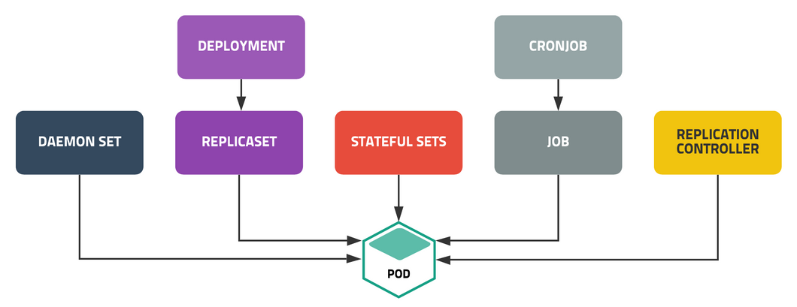
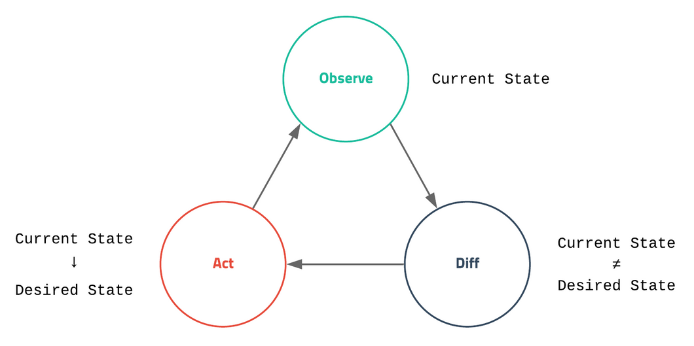
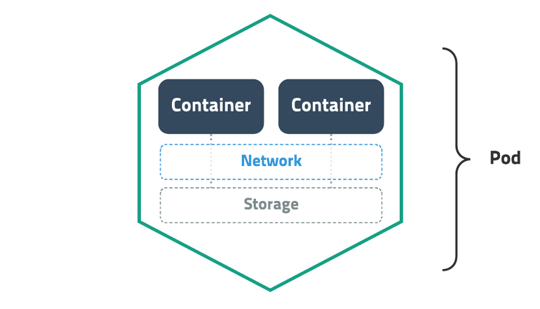
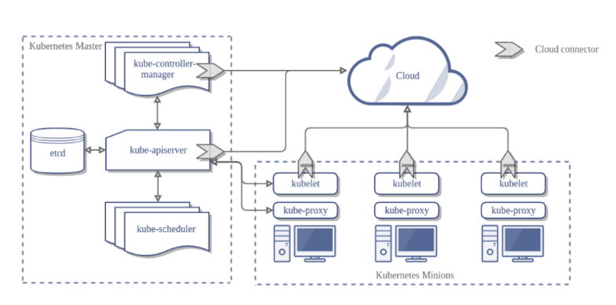
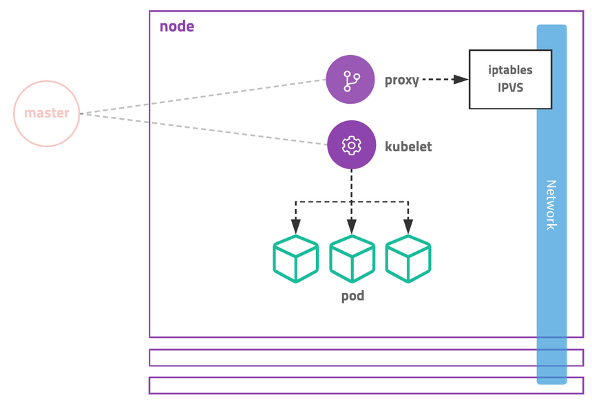
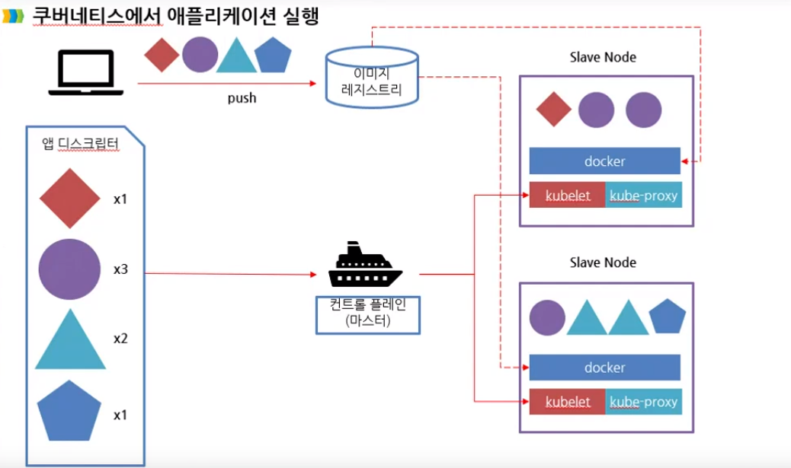
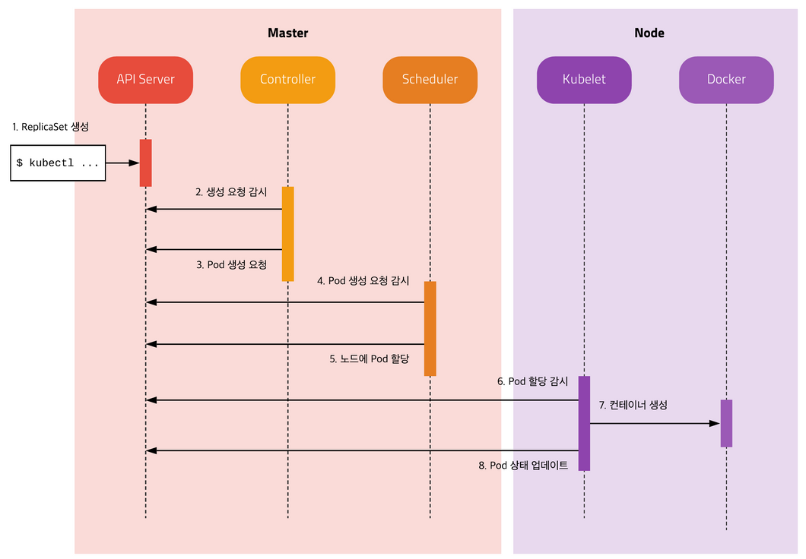

# Kubernetes

컨테이너 어플리케이션 배포를 돕는 오케스트레이터.

## 특징

- 개발자 입장 
    - 특정 인프라 관련 서비스를 어플리케이션에서 구현하지 않아도 됨.
      왜냐 개발 환경과 서비스 환경이 같으니까
    - 쿠버네티스의 서비스 검색, 확장, 로드 밸런싱등의 서비스를 이용하여 효과적인 서비스 제공.
    - 인프라와 인프라를 통합하는 방법을 파악하는 시간 낭비 없음.
    - 결국 실제 기능 개발에 주력할 수 있음.
- 운영팀 입장 
    - 언제든지 어플리케이션 재배치.
    - 어떤 노드에서 어플리케이션이 실행되는지 신경쓰지 않아도 됨.
    - 어플리케이션을 믹스 매치 시키면서 리소스를 매칭.

## 장점

- 불변형 인프라 원칙을 준수 
  - 시스템의 결함이 있더라도 사용자의 수정을 통해 변경되지 않음.
  - 이미지를 수정하는 것보다, 새로운 이미지를 만들면 기존 이미지를 유지할 수 있기 때문에, 오류 발생 즉시 롤백 가능.
- 온라인 자가 치유 시스템
  - 현재의 상태를 요구된 상태로 일치시키키려고 확인하는 과정이 지속.
  - 불안정한 시스템 상태와 신뢰성에 영향을 미치는 오류나 변화로부터 시스템을 보호.
- MSA를 좀 더 쉽게 만들 수 있는 추상화와 API 제공 
  - Pod 이나 Container group은 개발된 컨테이너 이미지를 단일 배포단위로 그룹화.
  - 또한 서비스 별 로드밸런싱, 네이밍, 검색등을 제공.
  - 네임스페이스는 격리와 접근제어를 제공해, 서비스 간 상호작용하는 정도를 제어.
- 어플리케이션 배포 단순화
- 하드웨어 활용도 극대화
  - 클러스터 노드의 가용 리소스에 최대한 맞춰 매치.
- 오토 스케일링
  - 개별 어플리케이션의 부하를 지속적으로 모니터링하지 않고,
  - 자동으로 리소스를 모니터링하고 인스턴스 수를 계속 조정하도록 지시.
- Ecosystem이 잘 갖춰져 있음.
- 다양한 배포방식

<p align="center"></p>

## 기본 개념

<p align="center"></p>

- Desire State
    - 관리자가 바라는 환경
    - 쿠버네티스는 현재 상태를 모니터링 하면서 관리자가 설정한 desire state를 유지하려는 작업을 지속적으로 진행. (장점 중 자가 치유 부분)
    - 관리자는 직접 명령을 내리지 않고 상태를 선언하는 방식을 사용해야함.
      Run과 같은 직접 실행 명령(imperative)이 아닌, Create와 같은 상태 생성(declative).

<p align="center"></p>

- Kubernetes Objects
    - Pod
        - 배포가능한 가장 작은 단위.
        - 한 개 이상의 컨테이너, 스토리지, 네트워크 속성을 가짐.
        - Pod 내 컨테이너는 스토리지와 네트워크를 공유함.
    - Replica Set
        - Pod을 여러 개 복제하여 관리하는 object.
        - Pod을 생성하고 갯수를 유지하기 위해서는 반드시 Replica set이 필요.
        - 복제할 갯수, 갯수를 체크할 라벨 선택자, 생성할 pod의 설정값을 가짐.
        - 직접 replica set을 사용하기 보단, deployment등 다른 object에 의해 사용 됨.
    - Service
        - 네트워크와 관련된 object.
        - Pod을 외부 네트워크와 연결하거나 로드밸런스를 생성할 때 사용.
        - 내부 DNS에 서비스 이름을 도메인으로 등록하기에, 서비스 디스커버리 역할.
    - Volume
        - 저장소와 관련된 object.


## 쿠버네티스 클러스터 아키텍쳐

<p align="center"></p>

### 마스터 노드 
- 전체 쿠버네티스 시스템을 관리하고 통제하는 컨트롤 플레인을 관장.
- 마스터는 관리자만 접근 가능하게 설정해야 함.
- 마스터가 죽으면 클러스터를 관리할 수 없기에 보통 3대를 구성하여 안정성을 높임.
- EKS의 경우 마스터를 AWS에서 자체 구성하여 안정성을 높임.(접속은 불가)
- 개발 환경 또는 소규모에서는 마스터와 노드를 분리하지 않고 사용하기도 함.
- kube-apiserver :
  - 전체 흐름을 관장. 인증과 통신, 권한을 검사.
  - 사용자, 컨트롤 플레인과 통신.
  - 실제하는 일은 key-value 저장소에 원하는 상태를 저장하고, 조회하는 역할.
  - 노드에서 실행 중인 컨테이너의 로그를 보는 디버거 역할도 수행.
- kube-scheduler :
  - 어떤 워커노드에 어떤 컨테이너를 배치할 지를 결정. 배치 전략가.
  - 할당되지 않은 pod을 여러 조건(필요 자원, 라벨)에 따라 적절한 노드에 할당.
- controller-manager :
  - 관련 리소스를 관리.
  - 구성 요소 복제, 워커 노드 추적, 노드 장애처리 등 클러스터 수준 기능 실행.
  - 쿠버네티스의 거의 모든 object들을 관리.
  - Object별로 분업화되어 Deployment는 replica set을, replica set은 pod을 생성하고, pod은 scheduler가 관리.
- etcd :
  - db, kube-apiserver 만 접근 가능.
  - 클러스터 구성을 지속적으로 저장하는 DB.
  - RAFT 알고리즘을 이용한 key-value 저장소.
  - 여러 개로 분산하여 복제가능하기에 안정성이 높고 속도도 빠른 편.
  - watch 기능이 있기에 상태가 변경되면 체크하여 로직 실행 가능.
  - 클러스터의 모든 설정, 상태 데이터가 저장되기에 백업이 잘되어있다면, 언제든 클러스터 복구 가능.
- cloud-controller-manager:
  - AWS, GCE, Azure등 클라우드에 특화된 모듈.
  - 노드 추가, 삭제, 로드 밸런서 연결, 볼륨을 연결 가능.
  - 각 클라우드 업체에서 자체 모듈을 만들어 제공.
- DNS:
  - 리소스의 end-point를 DNS에 맵핑하고 관리.
  - pod는 ip가 동적으로 할당되기에, 그 리소스에 접근하기 위해선 위치에 대한 정보가 필요.
    service discovery pattern
  - 쿠버네티스는 이를 DNS서버에 두고, 새로운 리소스가 등록되면 ip와 DNS 이름을 등록하여 이름을 기반으로 리소스에 접근 가능하게 설계.

## 워커 노드

<p align="center"></p>

- 실제 배포하고자 하는 어플리케이션의 실행을 담당.
- kublet :
  - kube-apiserver로 부터 명령을 받음.
  - Pod의 생명주기를 관리.
  - Pod을 생성하고, 상태를 주기적으로 마스터에 전달.
  - apiserver의 요청에 따라 컨테이너 로그를 전달하거나, 특정 명령을 대신 수행.
- kube-proxy :
  - 컨테이너 간의 통신 또는 노드 간의 통신. 트래픽 분산 및 연결.
  - Pod으로 연결되는 네트워크를 관리.
  - TCP, UDP, SCTP 스트림을 포워딩하고 여러개의 pod을 round-robin 형태로 서비스를 제공.
  - 초기에는 프록시 서버에 요청을 받고 pod에 전달하였으나, 시간이 지나며 iptables을 설정하는 방식으로 변경.
  - iptables의 규칙이 늘어남에 따라 느려지는 문제로 최근에는 IPVS를 지원.
- container-runtime
  - Pod를 통해 들어온  컨테이너를 실행한는 주체. 도커 이외에 다른 container runtime 존재. CRI-O, rtk 등.
- 컨트롤 플레인
    - 클러스터를 관리하는 기능.
    - 단일 마스터 노드에서 실행하거나, 여러 노드로 분할되고 복제돼 고가용성을 보장.
    - 클러스터의 상태를 유지하고 제어. 보통 어플리케이션을 실행하지는 않음.
    - 위 네 가지로 구성. (kube-apiserver, kube-scheduler, controller-manager, etcd)


<p align="center"></p>

## 실제 하나의 pod이 생성되는 흐름

<p align="center"></p>

- 각 모듈은 오직 API server와 통신.
- API server를 통해 etcd에 저장된 desired state에 필요한 작업을 수행.
- 아래 흐름은 ReplicaSet을 다뤘지만 DaemonSet등과 같이 다른 set들도 마찬가지 흐름.
- kubectl
    - ReplicaSet의 명세를 yml로 정의하고 apiserver에 명령 전달.
    - apiserver는 새로운 replica set ojbect를 etcd에 저장.
- kube controller
    - Controller 내 replica controller가 ReplicaSet을 감시.
    - ReplicaSet에 정의된 label selector 조건을 만족하는 pod이 존재하는지 확인.
    - 해당하는 label의 pod이 없다면, 정의된 ReplicaSet의 pod template을 토대로 pod 생성. (no assigne)
    - 생선을 apiserver에 전달하고, apiserver는 etcd에 저장.
- scheduler
    - No assign된 pod을 체크.
    - 있다면, 조건에 맞는 node를 찾아 pod을 할당.
- kublet
    - 자신의 node에 assign되었지만 생성되지 않은 pod을 체크.
    - 생성되지 않은 pod을 명세에 따라 생성.
    - Pod의 상태를 주기적으로 apiserver에 전달.

## Kubernetes Cheat Sheet

| 옵션    | 내용                                |
|-------|-----------------------------------|
| apply | 원하는 상태를 적용. 보통 -f 옵션으로 파일과 함께 사용.|
| get | 리소스 목록 출력.|
| describe | 리소소의 상태를 자세하게 출력.|
| delete | 리소스 제거.|
| logs | 컨테이너의 로그를 출력.  |
| exec | 컨테이너에 명령어를 전달. 주로 컨테이너에 접근할 때 사용. |
| config |  kubectl 설정을 관리. |
| label | label 확인(show-labels), 추가, 제거, 필터링 등. |

### Apply

```bash
# kubectl apply -f [파일명 또는 URL]
```

### Get

```bash
# Pod 조회
kubectl get pod

# 줄임말(Shortname)과 복수형 사용가능
kubectl get pods
kubectl get po

# 여러 TYPE 입력
kubectl get pod,service
#
kubectl get po,svc

# Pod, ReplicaSet, Deployment, Service, Job 조회 => all
kubectl get all

# 결과 포멧 변경
kubectl get pod -o wide
kubectl get pod -o yaml
kubectl get pod -o json

# Label 조회
kubectl get pod --show-labels
```

### describe

```bash
# kubectl describe [TYPE]/[NAME] 또는 [TYPE] [NAME]

# 조회한 이름으로 상세 확인
kubectl describe pod/wordpress-5f59577d4d-8t2dg # 환경마다 이름이 다릅니다
```

### delete

```bash
# kubectl delete [TYPE]/[NAME] 또는 [TYPE] [NAME]
```

- Pod이 제거되어도 다시 살아나는 건 정상.
  ReplicaSet에서 pod의 갯수를 desire state로 유지시키려 하기 때문.

### logs

```bash
# kubectl logs [POD_NAME]
# 실시간 로그 보기
kubectl logs -f wordpress-5f59577d4d-8t2dg
```

### exec

```bash
# kubectl exec [-it] [POD_NAME] -- [COMMAND]
```

- 여러개의 container가 존재하는 경우 -c  옵션으로 컨테이너를 지정.

### config

```bash
# 현재 컨텍스트 확인
kubectl config current-context

# 컨텍스트 설정
kubectl config use-context minikube
```

- 여러 개의 클러스터를 컨텍스트로 설정하고, 필요에 따라 선택 가능.