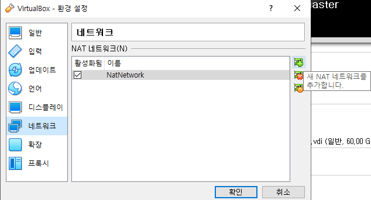
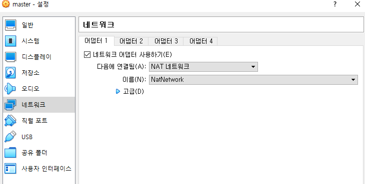
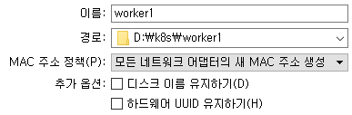

# 쿠버네티스 설치하기 in Virtual Box

[kubeadm 설치하기](https://kubernetes.io/ko/docs/setup/production-environment/tools/kubeadm/install-kubeadm/)

Virtual Box 및 Ubuntu 올리는 건 pass.

## 설치 순서

### 공통 설치 사항

1.Docker 설치

```bash
sudo apt-get install docker.io
```

2. kubeadm, kubelet 및 kubectl 설치

- nano install.sh 실행 후, 다음 script 입력
- chmod를 통해 executable로 변경 후 실행.

```bash
sudo apt-get update
sudo apt-get install -y apt-transport-https ca-certificates curl
sudo curl -fsSLo /usr/share/keyrings/kubernetes-archive-keyring.gpg https://packages.cloud.google.com/apt/doc/apt-key.gpg
echo "deb [signed-by=/usr/share/keyrings/kubernetes-archive-keyring.gpg] https://apt.kubernetes.io/ kubernetes-xenial main" | sudo tee /etc/apt/sources.list.d/kubernetes.list
sudo apt-get update
sudo apt-get install -y kubelet kubeadm kubectl
sudo apt-mark hold kubelet kubeadm kubectl
```

3. Swap 비활성화

```bash
sudo swapoff -a # swapoff in current terminal
sudo sed -i '/ swap / s/^\(.*\)$/#\1/g' /etc/fstab #set swapoff permanately
```

4. NAT network 추가

- 여기까지 설치를 마친 후, 현재 가상 시스템을 종료.
- Worker node 복제 전, NAT network 추가를 위해 파일→ 환경 설정 → 네트워크 탭으로 이동.
- 새 NAT network 추가.

<p align="center"></p>

- 가상 머신의 설정에 들어가서 방금 만든 NatNetwork를 설정.

<p align="center"></p>

5. 가상 머신 복제

- Worker node 생성을 위해 현재 가상 시스템을 복제 하는데, 이때 주의 할 점은 MAC 주소 정책의 옵션을 반드시 새 MAC 주소 생성으로 해줘야 함.

<p align="center"></p>

- 그 이후 옵션은 완전한 복제 → 현재 머신 상태 → 복제로 진행.

6. 만들어진 Master, worker node 가상머신들이 새로운 MAC 주소로 잘 생성되었는지 확인

- ip addr 로 각 가상 머신끼리 ping을 확인.
- 이때, 모두 같은 ip를 가지고 있다면 NAT network가 제대로 설정되었는지 다시 확인.

```bash
#ip addr로 각자의 ip 확인.
#ex) : ping 10.0.2.6
```

7. 복제 완료 후, 생성한 가상 머신들에 접속.

- 만들어진 Master, worker node 가상머신의 hostname 변경.

```bash
sudo nano /etc/hostname
reboot
```

### Master Node

1.kubeadm init 실행

- kubeadm init 실행 전

```bash
sudo kubeadm init
```

- 만약 다음과 같은 오류가 뜬다면 swap이 비활성화 되지 않은 것이니 다시 확인.

```bash
[init] Using Kubernetes version: v1.21.0
[preflight] Running pre-flight checks
	[WARNING IsDockerSystemdCheck]: detected "cgroupfs" as the Docker cgroup driver. The recommended driver is "systemd". Please follow the guide at https://kubernetes.io/docs/setup/cri/
error execution phase preflight: [preflight] Some fatal errors occurred:
	[ERROR Swap]: running with swap on is not supported. Please disable swap
[preflight] If you know what you are doing, you can make a check non-fatal with `--ignore-preflight-errors=...`
To see the stack trace of this error execute with --v=5 or higher
```

성공적으로 kubeadm이 실행되었다면 다음과 같은 결과를 볼 수 있음.

```bash
Your Kubernetes control-plane has initialized successfully!

To start using your cluster, you need to run the following as a regular user:

  mkdir -p $HOME/.kube
  sudo cp -i /etc/kubernetes/admin.conf $HOME/.kube/config
  sudo chown $(id -u):$(id -g) $HOME/.kube/config

Alternatively, if you are the root user, you can run:

  export KUBECONFIG=/etc/kubernetes/admin.conf

You should now deploy a pod network to the cluster.
Run "kubectl apply -f [podnetwork].yaml" with one of the options listed at:
  https://kubernetes.io/docs/concepts/cluster-administration/addons/

Then you can join any number of worker nodes by running the following on each as root:

kubeadm join 10.0.2.15:6443 --token 8666ue.g0etpjku5g3yr8me \
	--discovery-token-ca-cert-hash sha256:fe7922ab94ba81a62e59485b96dbea4fc841d16b19ee33cedf3ccb7417881fdd
```

- 여기서 위에 세 줄은 Master node에서 실행해야하는 구문이며, 밑에 두줄은 worker node에서 실행할 것이므로 text에 옮겨서 저장해둠.

2. Master node script 실행.

- 위의 코드에 상위 세줄의 코드를 Master node가 될 가상환경에서 실행.

```bash
mkdir -p $HOME/.kube
sudo cp -i /etc/kubernetes/admin.conf $HOME/.kube/config
sudo chown $(id -u):$(id -g) $HOME/.kube/config
```

3. kubectl 동작 확인.

- kubectl get node 동작으로 제대로 설정이 되었는지 확인.
- 참고로 kubectl은 master node에서 하위 worker node를 관리하기 위한 cli로 볼 수있음.

```bash
kubectl get node

#Result
#NAME     STATUS     ROLES                  AGE    VERSION
#master   NotReady   control-plane,master   116s   v1.21.0
```

- 위와 같이 동작된다면 성공.

### Worker Node

Master node에서 init의 결과 script 중 join 부분을 실행

```bash
sudo kubeadm join 10.0.2.15:6443 --token 8666ue.g0etpjku5g3yr8me \
	--discovery-token-ca-cert-hash sha256:fe7922ab94ba81a62e59485b96dbea4fc841d16b19ee33cedf3ccb7417881fdd
```

간혹 join 이 안된다면, sudo kubeadm reset을 통해 초기화 후 다시 시도.

### Network policy 설정

- Master와 Worker 노드의 설정이 끝났다면 다음과 같은 결과를 볼 수있음

```bash
kubectl get node # At master node

# NAME      STATUS     ROLES                  AGE     VERSION
# master    NotReady   control-plane,master   7m46s   v1.21.0
# worker1   NotReady   <none>                 2m27s   v1.21.0
# worker2   NotReady   <none>                 2m19s   v1.21.0
```

- 하지만 보다시피 NotReady 상태로 network policy 를 설정해줘야 함.
    - [Cluster Networking](https://kubernetes.io/docs/concepts/cluster-administration/networking/#how-to-implement-the-kubernetes-networking-model)
- Official에 나온 networking 설정법에 참조하고 Weave Net에 대한 설치를 진행.
    - [Integrating Kubernetes via the Addon](https://www.weave.works/docs/net/latest/kubernetes/kube-addon/)

- 다음과 같은 명령을 Master node에서 실행.

```bash
#Run at Master node
kubectl apply -f "https://cloud.weave.works/k8s/net?k8s-version=$(kubectl version | base64 | tr -d '\n')"

# serviceaccount/weave-net created
# clusterrole.rbac.authorization.k8s.io/weave-net created
# clusterrolebinding.rbac.authorization.k8s.io/weave-net created
# role.rbac.authorization.k8s.io/weave-net created
# rolebinding.rbac.authorization.k8s.io/weave-net created
# daemonset.apps/weave-net created
```

- network policy가 설정되었다면 get node를 통해 다시한번 결과 확인.

```bash
kubectl get node

# NAME      STATUS   ROLES                  AGE   VERSION
# master    Ready    control-plane,master   17m   v1.21.0
# worker1   Ready    <none>                 12m   v1.21.0
# worker2   Ready    <none>                 12m   v1.21.0
```

- 아까와는 다르게 Ready 상태로 바뀐 것을 확인할 수 있으며, master & worker cluster 구성이 완료.