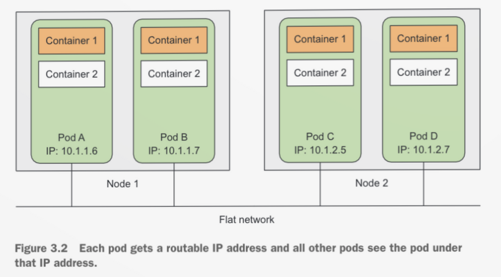
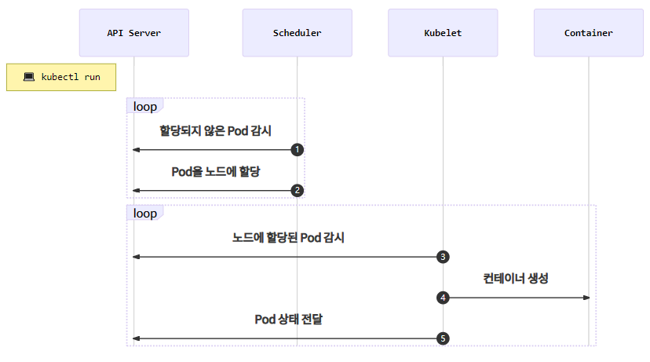

# Pod

- 쿠버네티스에서 관리하는 가장 작은 배포 단위
- Docker는 컨테이너를, Kubernetes는 pod을 만듬.
- Pod은 한개 또는 여러개의 컨테이너를 포함할 수 있음.
- Pod는 다수의 노드에 걸쳐서 생성되지 않고, 단일 노드에서만 실행.
- 여러 프로세스 실행을 위해서는 컨테이너 당 단일 프로세스 유리.(특정 상황 예외)
- Kubernetes 1.8 이상부터는 run 명령어가 pod을 만들고 그 이하는 deployment를 만듬.
- 장점
    - 밀접하게 관련된 프로세스를 함께 실행하고 하나의 환경에서 동작하는 것처럼 보임.
    - 동일한 환경을 제공하면서도 다소 격리된 상태.
- 특징
    - Pod내 컨테이는 ip와 port를 공유. ex) A 컨테이너가 8080, B 컨테이너가 7022라고 가정하면, B에서 A를 localhost:8080으로 호출 가능.
    - 컨테이너간 디스크 볼륨을 공유. 최근 어플리케이션뿐만 아니라, 로그 수집기, 리버스 프록시 등이 같이 주변 솔루션과 배포되는 경우가 많음. 특히 로그 수집기의 경우 컨테이너가 분리된 경우 파일 시스템이
      분리되어 로그 파일이 읽는 것이 불가능하지만, 같은 pod내의 컨테이너의 경우 볼륨을 공유하여 가능.

<p align="center"></p>

```bash
kubectl run echo --image ghcr.io/subicura/echo:v1
```

# Pod이 생성되는 과정

<p align="center"></p>

1. Scheduler가 apiserver를 감시하면 unassigned 된 pod이 있는지 감시.
2. 이를 감지하면 scheduler가 적절한 노드에 pod을 할당.
3. 노드에 설치된 kubelet은 자신의 노드에 할당된 pod이 있는지 확인.
4. 자신에게 할당된 pod의 정보를 확인하고 container를 생성.
5. 할당된 pod의 정볼르 apiserver에 전달.

# Pod YAML

```yaml
apiVersion: v1
kind: Pod
metadata:
  name: echo
  labels:
    app: echo
spec:
  containers:
    - name: app
      image: ghcr.io/subicura/echo:v1
```

### Probe

- pod의 상태를 probe를 통해 확인하고, pod의 시작, 정지, 재시작을 설정.

### livenessProbe

- 컨테이너가 정상적으로 동작하는지 확인하고, 이상 시 재시작.
- 정상인지 확인은 httpGet, TcpSocket, exec 등이 존재.
- 버그가 생겨도 높은 가용성을 보임.

### ReadinessProbe

- pod가 ready state에 있는지 확인하고 정상 서비스를 시작하는 기능.
- 컨테이너가 준비되지 않았으면 들어오는 요청을 제외하고 로드밸런싱 하지 않음.

### StartupProbe

- 어플리케이션 시작 시기를 확인하여 가용성을 높임.
- 시작 시간이 오래 걸리는 경우 사용하면 좋음.
- StartupProbe가 실행 중에는 Liveness와 Readiness의 기능을 일시적으로 비활성화.

```yaml
apiVersion: v1
kind: Pod
metadata:
  name: echo-lp
  labels:
    app: echo
spec:
  containers:
    - name: app
      image: ghcr.io/subicura/echo:v1
      livenessProbe:
        httpGet:
          path: /
          port: 3000
      readinessProbe:
        httpGet:
          path: /
          port: 3000
```

### 다중 컨테이너

- Pod에는 한개 또는 그 이상의 컨테이너가 존재할 수 있음.
- 하나의 Pod에 속한 컨테이너는 서로 네트워크를 localhost로 공유하고 디렉토리를 공유.

```yaml
apiVersion: v1
kind: Pod
metadata:
  name: counter
  labels:
    app: counter
spec:
  containers:
    - name: app
      image: ghcr.io/subicura/counter:latest
      env:
        - name: REDIS_HOST
          value: "localhost"
    - name: db
      image: redis
```

### 환경변수

- container에 환경 변수 추가 가능.

```yaml
apiVersion: v1
kind: Pod
metadata:
  name: mysql
  labels:
    app: mysql
spec:
  containers:
    - name: mysql-container
      image: mysql:5.7
      env:
        - name: MYSQL_ROOT_PASSWORD
          value: 123456
```