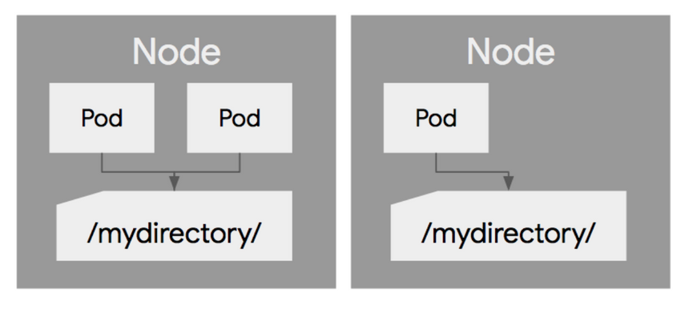
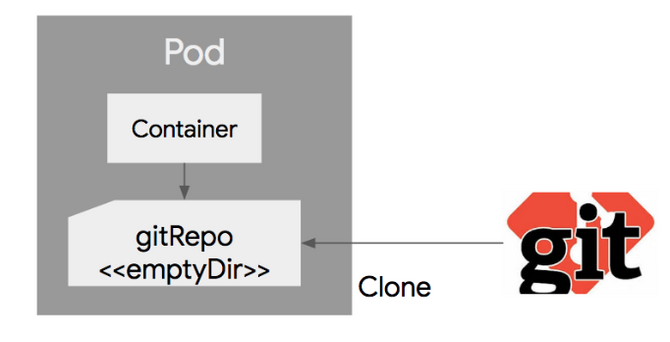
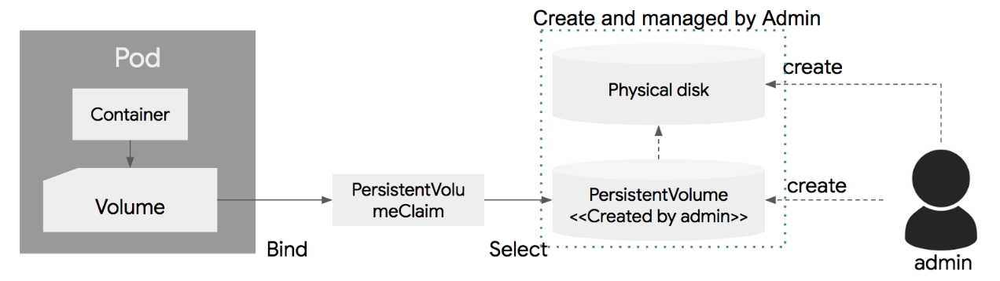
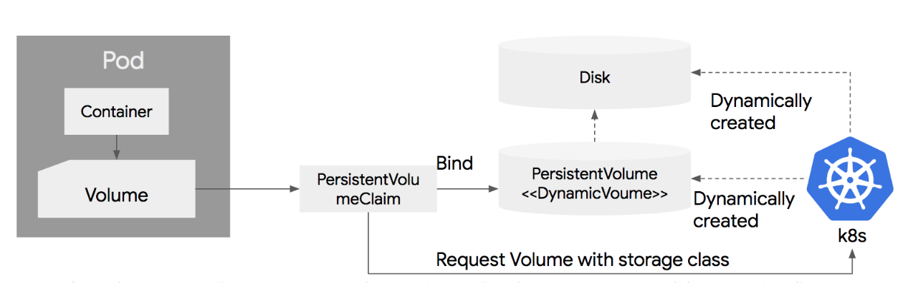

# Volume

- Pod에 종속되는 디스크.
- Pod에 종속되기에 Pod내의 컨테이너들이 공유해서 사용 가능.
- 볼륨 리스트는 official에서 확인 가능.
    - [Volumes](https://kubernetes.io/docs/concepts/storage/volumes/#types-of-volumes)

# Empty dir

- Pod가 생성될 때 같이 생성되어, 사라질 때 같이 삭제되는 임시 볼륨.
- Pod내 컨테이너가 문제가 생겨 삭제되고 재가동 되더라도, pod 단위로 생성되기에 empty dir은 계속 사용가능.
- 물리적으로 노드에서 할당해주는 디스크에 저장. 환경에 따라 로컬 디스크 또는 네트워크 디스크 등.
- emptyDir.medium 필드를 "Memory"로 설정할 경우 메모리에 저장.
- 컨테이너와 공유하기 위해 사용.

```yaml
apiVersion: v1
kind: pod
metadata:
  name: shared-volumes
spec:
  containers:
    - name: redis
    image: redis
    volumeMounts:
      - name: shared-storage
      mountPath: /data/shared
    - name: nginx
    image: nginx
    volumeMounts:
      - name: shared-storage
      mountPath: /data/shared
  volumes:
    - name: shared-storage
    emptyDir: { }
```

- shared-storage라는 emptyDir을 만들고 이를 redis와 niginx 컨테이너에서 공유.

# Host path

<p align="center"></p>

- 노드의 디스크 경로를 pod에 마운트하여 사용하는 것.
- 여러 사이의 pod 사이에 공유해서 사용 가능.
- 한 가지 알아야 할 사실은, pod의 문제가 생겨 재가동될 때 다른 노드에서 생성될 경우, 이전 노드에서 hostpath의 데이터는 가져올 수 없음.
- 노드의 디스크 경로만을 공유하기에, 같은 노드 내의 pod들만 공유 가능.
- 노드와 공유하기 위해 사용.
- hostPath는 파일 시스템에 접근하는데 용이하게 사용됨.
- 로그 수집기 pod가 있는 경우, 노드의 파일 시스템에 접근하여 로그를 가져올 수 있음.

```yaml
apiVersion: v1
kind: Pod
metadata:
  name: hostPath-pod
spec:
  containers:
    - name: redis-container
    image: redis
    volumeMounts:
      - name: brettPath
      mouthPath: /data/shared
  volumes:
    - name: brettPath
    hostPath:
      path: /tmp
      type: Directory
```

# GitRepo

<p align="center"></p>

- git repository의 특정 revision을 clone하여 내려받은 후 디스크 볼륨을 생성.
- empty dir로생성.

```yaml
apiVersion: v1
kind: Pod
metadata:
  name: git-repo-pod
spec:
  containers:
    - name: web-server
    image: nginx
    volumnMounts:
      - name: html
      mountPath: /usr/share/nginx/html
      readOnly: true
    ports:
      - containerPort: 80
      protocol: TCP
  volumes:
    - name: html
    gitrepo:
      repository: https://github.com/luksa/kubia-website-example.git
      revision: master
      directory: .
```

[kubia-website-example.git](https://github.com/luksa/kubia-website-example.git) 의 master 리비전을 클론으로 다운받아서
/usr/share/nginx/html에 마운트 시키는 yaml

# PersistentVolume and PersistentVolumeClaim

<p align="center"></p>

- 쿠버네티스는 추상화를 통해, 인프라(컨테이너, 디스크, 네트워크 등)를 손쉽게 설정할 수 있도록하는 개념을 가지고 있음.
- 인프라에 종속적인 부분은 시스템 관리자가 설정하고, 개발자는 간단하게 사용 가능하도록 디스크 볼륨에 PersistentVolume(PV)와 PersistentVolumeClaim(PVC)라는 개념을 도입.
- 시스템 관리자는 실제 물리 디스크를 생성하고 이를 PersistentVolume이라는 이름으로 쿠버네티스에 등록.
- 개발자는 pod에서 볼륨 정의 시, 물리 디스크의 특성을 정의하는 것이 아닌, PersistentVolumeClaim을 지정하여, 관리자가 생성한 PV와 연결.
- 이때 주의할 점은, Pod의 생명 주기와 상관없이 volume은 따로 관리해야함.

### PersistentVolume(PV)

- 물리 디스크를 쿠버네티스에 정의한 것.

```yaml
apiVersion: v1
kind: PersistentVolume
metadata:
  name: pv-test
spec:
  capacity:
    storage: 5Gi
  volumeMode: FileSystem
  accessModes:
    - readWriteOnce
  persistentVolumeReclaimPolicy: Recycle
  storageClassName: slow
  mountOptions:
    - hard
    - nfsvers=4.1
  nfs:
    path: /tmp
    server: 172.17.0.2
```

- NFS 파일시스템 5gb를 정의한 예제.
- capacity
    - 볼륨의 용량.
- volumeMode
    - FileSystem(default) 또는 raw 설정.
- reclaimPolicy
    - PV는 연결된 PVC가 삭제된 이후에 재사용이 가능한데, 재사용시 내부의 데이터를 유지할지를 정할 수 있음.
- Retain
    - PV의 내용 유지
- Recycle
    - 재사용 되며, 자동으로 rm -rf로 삭제한뒤 사용 됨.
- Delete
    - 사용이 끝난 뒤 볼륨 삭제. AWS EBS, GCE PD,Azure Disk등이 이에 해당.
    - ReclaimPolicy는 디스크 특성에 따라 적용 가능, 불가능한 policy가 있음.
- AccessMode
    - Pod에서 PV로 동시 접근에 대한 정책.
- ReadWriteOnce(RWO)
    - 하나의 pod에만 마운트되고, 하나의 pod에서만 사용 가능.
- ReadOnlyMany(ROX)
    - 여러개의 pod에서 동시에 접근 가능하며, 오직 읽기만.
- ReadWriteMany(RWX)
    - 여러개의 pod에서 동시에 읽고 쓰기 가능.
    - 디스크 특성에 따라 사용가능한 policy가 나뉘어 있음.

- PersistentVolume의 life cycle
    - PV는 생성 시 available 상태가 되고,
    - PVC에 bind되면 bounded 상태로 변경.
    - binding된 PVC가 삭제되면, PV는 삭제되는 것이 아니라 Release 상태로 변경.
    - available이 아니라면 사용이 불가능하고, 보관 상태로 존재.

### PersistentVolumeClaim

- PVC는 pod의 볼륨과 PV를 바인딩하는 관계 선언.

```yaml
apiVersion: v1
kind: PersistentVolumeClaim
metadata:
  name: pvc-test
spec:
  accessModes:
    - ReadWriteOnce
  volumeMode: FileSystem
  resources:
    requests:
      storage: 8Gi
  storageClassName: slow
  selector:
    matchlabels:
      release: "stable"
    matchExpressions:
      - { key: environment, operator: In, values: [ dev ] }
```

- AccessModes와 volumeMode는 PV와 동일
- resources는 PV와 같이 필요한 사이즈를 정의함.
- selector를 통해 label selector 방식으로 이미 생성되어 있는 PV 중 label이 매칭되는 볼륨을 찾아 연결.

# Dynamic provisioning

<p align="center"></p>

- Pod에 Persistent Volume을 연결하는것은 물리 디스크 생성→ 생성된 물리디스크를 PV로 선언 → PV와 PVC 연결 → Pod 에서 사용의 순서
- 쿠버네티스에서는 이 작업이 수동이 아닌, 자동으로 진행시킬 수 있는 dynamic provisioning 지원.
- PVC만 정의 해놓으면 물리디스크 생성과, PV로 선언하는 부분을 자동으로 진행.
- 실제 사용환경에서는 다양한 형태의 디스크(nVME, HDD, SDD, NFS 등)를 성능에 따라 사용.
- Dynamic provisioning은 storageClass 지정을 통해 이에 맞는 디스크를 생성. 지정하지 않는다면 default로 생성.

### Storage Class

- PVC 정의시, storageClassName에 정의한 storageClass를 적으면 PVC에 연결되고, storageClass에서 정의된 명세에 따라 물리 디스크와 PV를 자동 생성함.

```yaml
apiVersion: storage.k8s.io/v1
kind: StorageClass
metadata:
  name: slow
provisioner: kubernetes.io/aws-ebs
parameters:
  type: io1
  zones: us-east-1d, us-east-1c
  iopsPerGB: "10"
```

```yaml
apiVersion: storage.k8s.io/v1
kind: StorageClass
metadata:
  name: slow
provisioner: kubernetes.io/gce-pd
parameters:
  type: pd-standard
  zones: us-central1-a, us-central1-b
```