# Controller

## ReplicaSet

- 단독으로 Pod을 만드는 경우 문제가 생겼을 시, 자동으로 복구되지 않음.
- 정해진 수 만큼 복제하고 관리하는 것이 ReplicaSet.
- label을 이용해 pod을 체크하기 때문에, label이 겹치지 않게 신경써야함.
- 실제에서는 ReplicaSet을 단독으로 사용하지 않고, deployment가 ReplicaSet을 이용하고, 주로 deployment를 사용.

### ReplicaSet의 흐름

<p align="center">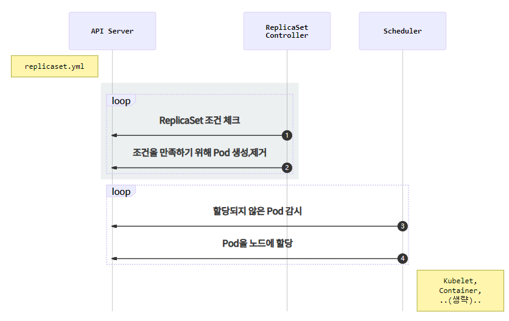</p>

1. `ReplicaSet Controller`는 ReplicaSet조건을 감시하며 current state와 desire state가 다른 것을 체크
2. `ReplicaSet Controller`가 desire state가 되도록`Pod`을 생성하거나 제거
3. `Scheduler`는 API서버를 감시하면서 할당되지 않은`Pod`이 있는지 체크.
4. `Scheduler`는 할당되지 않은 새로운`Pod`을 감지하고 적절한`노드`에 배치.
5. 이후 pod의 동작 수행.

### ReplicaSet YAML

```yaml
apiVersion: apps/v1
kind: ReplicaSet
metadata:
  name: nginx
spec:
  replicas: 3 # 원하는 pod의 갯수
  selector: # label check 조건
    matchLabels:
      app: nginx # template metadata labels와 동일.
  template: # pod의 spec과 동일.
    metadata:
      labels:
        app: nginx
    spec:
      - containers:
          name: nginx-container
          image: nginx-latest
```

- replicas의 갯수를 변경하여 scale-out 가능.

## DaemonSet

<p align="center">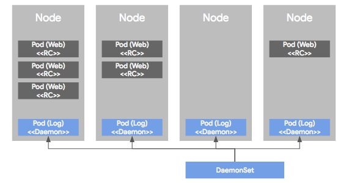</p>

- 각각의 노드에서 하나의 pod씩만 동작시키게 관리하는 컨트롤러.
- ReplicaSet이나 replica controller가 관리하는 pod의 경우, 여러 노드의 상황에 따라 비균등적으로 배포되지만, DaemonSet은 균등하게 하나씩.
- 주로 서버의 모니터링이나 로그 수집기에서 이용.

<p align="center">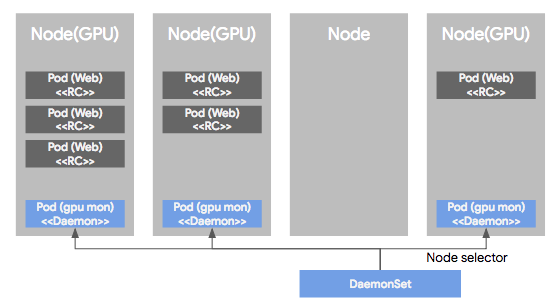</p>

- 특정 노드에만 pod를 배포할 수 있 도록, pod의 "node selector"를 사용하여 라벨을 통해 특정 노드만을 선택할 수 있게 함.

## StatefulSet

- 앞에서 정리한 ReplicaSet, Job 등은 상태가 유지되지 않는 어플리케이션(Stateless)을 관리하기 위해 사용.
- 즉, Pod가 수시로 재시작되거나 디스크 내용이 유실되는 경우여도 문제가 없는 workload.
- Webserver, WAS(Web Application Server) 등에 사용.
- 그러나, 디스크에 데이터가 유지되어야 하는 데이터베이스 같은 경우, 기존의 controller로 지원하기 어려운 부분이 존재.

### Reaseon

1. Pod의 불규칙적인 이름
    - Stateless pod를 관리하는 컨트롤러들의 pod name은 불규칙적.
    - 따라서 master / slave 형태를 가진 어플리케이션에서는 master server의 이름을 특정할 수 없음.
2. Pod의 기동 순서.
    - ReplicaSet같은 컨트롤러의 경우 pod들은 병렬로 동시에 기동.
    - 하지만 master / slave 형태를가진 어플리케이션에서는 master node가 먼저 기동되고 이후에 slave node가 기동되는 순차성을 가져야 함.
3. 볼륨 마운트
    - Pod에 볼륨을 마운트하는 과정은

    1. 관리자가 물리 디스크를 생성
    2. 물리 디스크를 Persistent volume를 통해 쿠버네티스에 정의
    3. Persistent volume을 Persistent Volume Claim를 통해 binding

    - ReplicaSet 등과 같은 컨트롤러로 pod을 정의하게 되면, template을 통해 PV와 PVC를 정의하는데 이렇게되면 오직 한개의 PV와 PVC만 정의됨.
    - 맨 처음 생성된 pod에만 PV와 PVC가 연결되고, 나머지 pod들은 PVC를 얻지 못해 디스크를 사용할 수 없음.

<p align="center">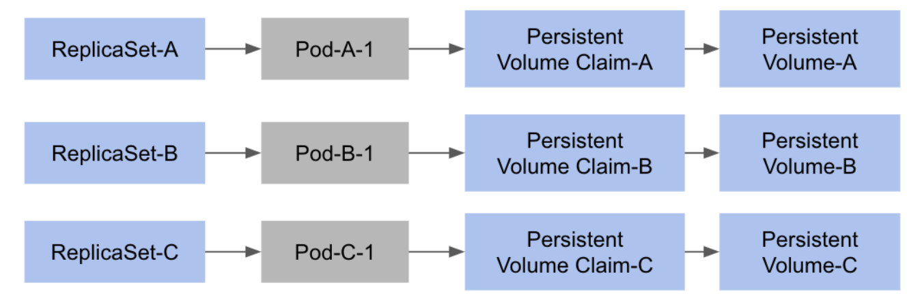</p>

- 따라서, ReplicaSet과 같은 컨트롤러로 PV를 연결하고자 한다면, pod마다 개별적인 PV와 PVC가 바인딩 되어야 함.

### StatefulSet

- 위와 같은 문제점을 `StatefulSet`로는 해결 가능.

1. Pod 이름에 대한 규칙성 제공
    - {Pod name}-{order}의 형태로 이름이 정해지며, mysql을 예로 들면 mysql-0, mysql-1..과 같은 식으로 생성.
2. 배포 시, 순차적인 기동과 업데이트
    - 동시에 모든 pod이 생성되는 것이 아닌, 이름의 0, 1, 2와 같은 순서대로 pod이 실행.
3. 개별 pod에 대한 디스크 볼륨 관리
    - StatefulSet에서는 `Persistent Volume Claim`을 template 형태로 정의, pod마다 각각 PVC와 PV를 생성, 관리 가능.

### StatefulSet 생성

```yaml
apiVerson: apps/v1
kind: StatefulSet
metadata:
  name: nginx-stateful
replicas: 3
...
template:
  ...
  volumeClaimTemplates:
      - metadata:
        name: www
        spec:
          accessMode: [ "ReadWriteOnce" ]
          storageClassName: "standard"
          resources:
            requests:
              storage: 1Gi
```

- ReplicaSet등과 크게 다를게 없지만, template에서 `volumeClaimTemplates`가 추가 됨.
- 이를 통해 pod 마다 PVC와 PV를 생성하도록 함.

### 기동 순서의 조작

- 기본적으로 StatefulSet은 0, 1, 2 의 순서로 생성되고 2, 1, 0의 순서로 삭제 됨.
- 만약 순서에 상관없이 병렬로 실행하고 싶다면

```yaml
spec:
  podManagementPolicy: Parallel
  # podManagementPolicy: OrderedReady # default
```

### Pod scale in and out

- 만약 동작 중인 pod에서 문제가 생기거나 스케일링 된다면, 연결되어 있는 PV와 PVC는 어떻게 될 것인가
- 이 때, 비정상 종료된 pod에 연결된 PVC는 삭제되지 않고 디스크 볼륨의 내용을 유지.
- 그리고 pod이 재가동되면, pod이 순서에 맞게 다시 생성되고 번호에 맞는 PVC가 다시 연결되어 유실없이 서비스 가능.

<p align="center">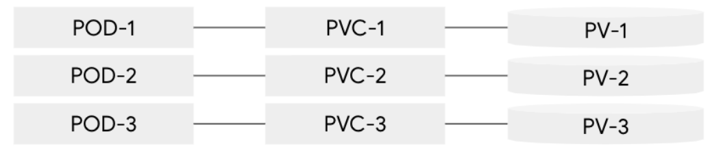</p>
<p align="center">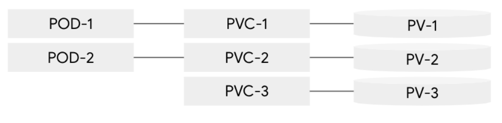</p>
<p align="center">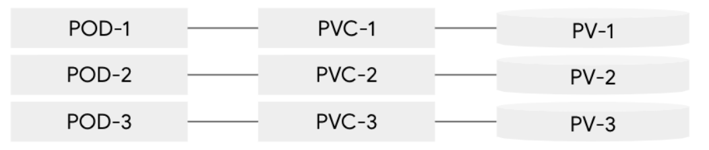</p>

## Job

<p align="center">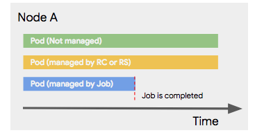</p>

- 한번만 실행되고 끝나는 형태의 작업.
- 또는 웹서버 처럼 계속 pod가 존재할 필요없이, 작업할 때만 pod를 띄워야하는 경우
- 이런 모델을 지원하는 컨트롤러가 `job`.
- Job에 의해서 관리되는 pod는 job이 끝나면 pod 역시 종료됨.
- Job을 정의할 때, 컨테이너 spec 부분에 image와 함께 job이 수행해야 할 command를 정의해줘야함.
    - command의 실행 결과에 따라 job의 성공, 실패를 판단(exit code)
    - 결과에 따라 재가동할지, 아니면 끝낼지 설정할 수 있음.

```yaml
apiVersion: batch/v1
kind: Job
metadata:
  name: pi
spec:
  template:
    containers:
      - name: pi-container
      image: perl
      command: [ "perl", "-Mbignum=bpi", "-wle", "print bpi(2000)"
          restartPolicy: Never
            backoffLimit: 4
```

### 장애 발생 시

<p align="center">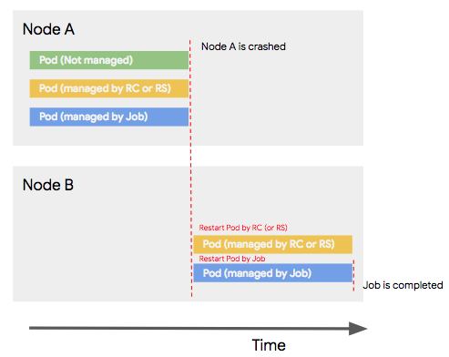</p>

- 기본적으로 ReplicaSet이나 Replica Controller의 경우 장애 발생 시, 관리되는 pod을 다른 노드에서 재 가동시키고, 관리되지 않는 노드들은 노드에서 사라지고 재 가동 되지 않음.
- Job의 경우 장애 발생 시, 재가동을 시킬지 안 시킬지 선택할 수 있음.
- 재가동이라는 말은 중간부터 시작하는 resume이 아닌 restart의 개념이기에, 처음부터 다시 시작할 때 문제가 없거나 데이터 겹침이 발생하지 않을 때 설정해야 함.

### Sequential & parallel jobs

<p align="center">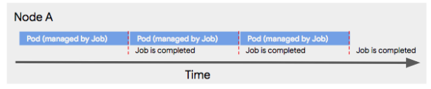</p>

- Batch의 경우 데이터가 크거나 범위를 나눠서 작업하는 경우 같은 작업을 연속해서 실행하는 경우가 있음.
- 이런 경우 job은 같은 pod을 여러번 실행할 수 있는 설정이 가능한데, job 설정의 completion에 횟수를 주면, 횟수만큼 순차적으로 반복 됨.

<p align="center">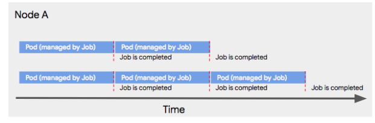</p>

- 여러 작업 중 순차 실행이 아닌 병렬로 처리하고 싶다면, parallelism에 동시에 실행하고 싶은 pod의 갯수를 지정해주면 됨.
- 위의 그림은 completion을 5로 parallelism을 2로 줌.

### CronJob

- Job에서 실행되는 작업 중 주기적으로 실행할 필요가 있을 때 사용.
- 즉, 정해진 스케쥴에 따라 주기적으로 job controller에 의해 실행하는걸 cron job.
- 사용법은 job과 크게 다르지 않으며, schedule이라는 항목이 추가됨.
- linux의 cron과 같음

```yaml
apiVersion: batch/v1beta
kind: CronJob
metadata:
  name: hello-cronjob
spec:
  schedule: "* /1 * * * *" # 1분 마다
  jobTemplate:
    spec:
      template:
        containers:
          - name: hello
        images: busybox
        args:
          - /bin/sh
          - -c
          - date; echo Hello from the Kubernetes cron job exmaple
        restartPolicy: OnFailure
```