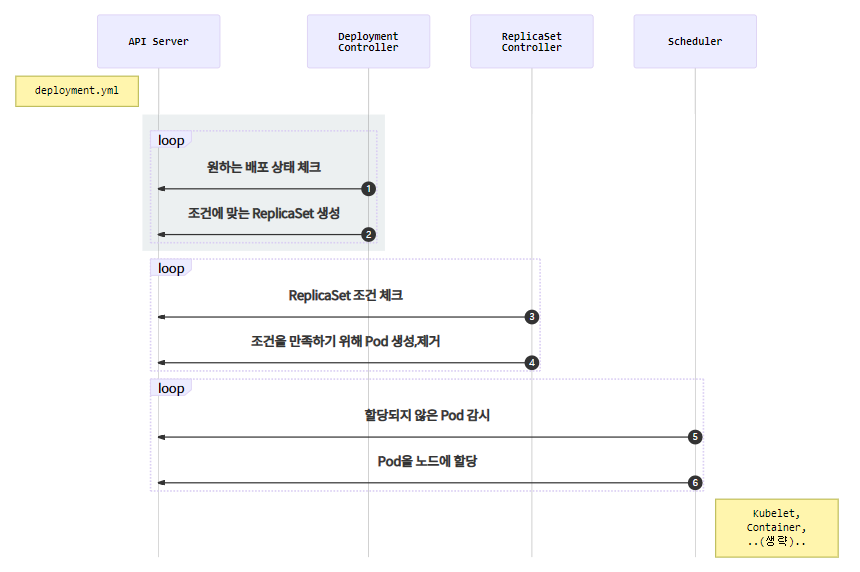
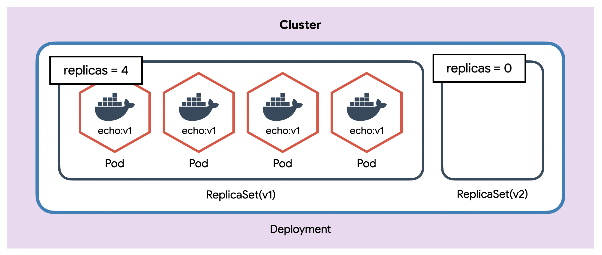
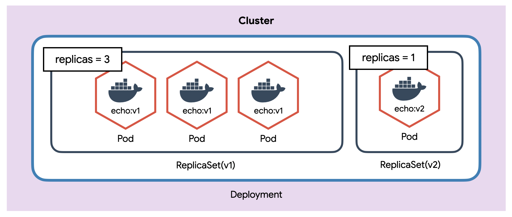
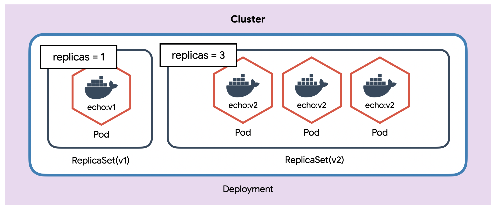
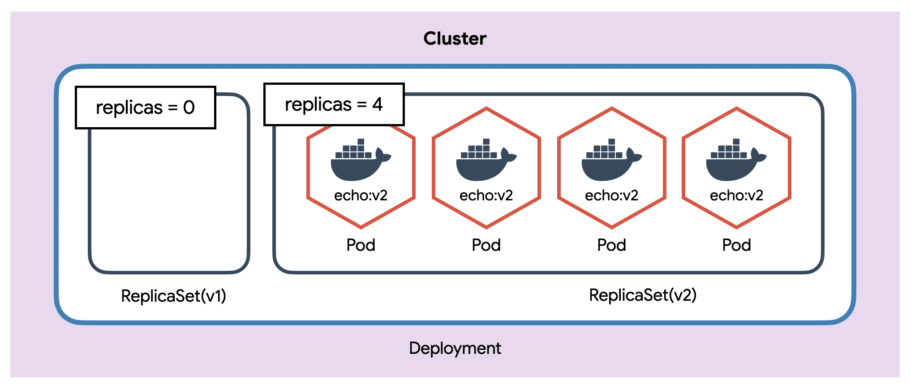

# Deployment

- 가장 많이 사용되는 object.
- ReplicaSet을 이용하여 pod을 업데이트하고, 이력을 관리

## Deployment의 흐름

<p align="center"></p>

1. `Deployment Controller`는 Deployment조건을 감시하며 current state와 desire state가 다른 것을 체크
2. `Deployment Controller`가 desire state가 되도록`ReplicaSet`설정
3. 이후 과정은 ReplicaSet과 동일.

## Deployment YAML

```yaml
apiVersion: apps/v1
kind: Deployment
metadata:
  name: echo-deploy
spec:
  replicas: 4
  selector:
    matchLabels:
      app: echo
      tier: app
  template:
    metadata:
      labels:
        app: echo
        tier: app
    spec:
      containers:
        - name: echo
          image: ghcr.io/subicura/echo:v1
```

- kind를 제외하고는 ReplicaSet과 동일
- deploy의 image가 바뀌거나 하면 pod이 업데이트 되며 기존 pods는 모두 제거되고 다시 생성됨.
- 즉,버젼이 바뀌면 새로운 ReplicaSet을 만들어 pod을 업데이트하고 기존 ReplicaSet은 제거.

## Rolling Update

- 순차적으로 ReplicaSet내의 pod들이 생성 및 해제.

```yaml
spec:
  strategy:
    type: RollingUpdate
    rollingUpdate:
      maxSurge: 1
      maxUnavailable: 1
```

- maxSurge
    - 기본값은 25%, 또는 갯수로도 설정 가능.
    - 업데이트 시, 몇개의 pod을 더 할당받아 update에 사용할 것인가. ex) 총 pod의 갯수가 4개라면, 추가로 1개의 pod을 더 생성하여 update(4+1)
- maxUnavailable
    - 기본값은 25%, 또는 갯수로도 설정 가능.
    - 현재 동작하는 pod중 최대 몇개까지 동작을 멈추고 업데이트 시킬 것인가.

<p align="center"></p>
<p align="center"></p>
<p align="center"></p>
<p align="center"></p>

- kubectl describe로 보다 자세히 관찰 가능

```bash
kubectl describe deploy/echo-deploy

# Events:
#  Type    Reason             Age   From                   Message
#  ----    ------             ----  ----                   -------
# Normal  ScalingReplicaSet  5m    deployment-controller  Scaled up replica set echo-deploy-76dcd9f4f9 to 4
# Normal  ScalingReplicaSet  2m    deployment-controller  Scaled up replica set echo-deploy-77cd7699f4 to 1
# Normal  ScalingReplicaSet  2m    deployment-controller  Scaled down replica set echo-deploy-76dcd9f4f9 to 3
# Normal  ScalingReplicaSet  2m    deployment-controller  Scaled up replica set echo-deploy-77cd7699f4 to 2
# Normal  ScalingReplicaSet  2m    deployment-controller  Scaled down replica set echo-deploy-76dcd9f4f9 to 2
# Normal  ScalingReplicaSet  2m    deployment-controller  Scaled up replica set echo-deploy-77cd7699f4 to 3
# Normal  ScalingReplicaSet  2m    deployment-controller  Scaled down replica set echo-deploy-76dcd9f4f9 to 1
# Normal  ScalingReplicaSet  2m    deployment-controller  Scaled up replica set echo-deploy-77cd7699f4 to 4
# Normal  ScalingReplicaSet  2m    deployment-controller  Scaled down replica set echo-deploy-76dcd9f4f9 to 0
```

- Deployment는 변경된 상태를 기록

```bash
# 히스토리 확인
kubectl rollout history deploy/echo-deploy

# revision 1 히스토리 상세 확인
kubectl rollout history deploy/echo-deploy --revision=1

# 바로 전으로 롤백
kubectl rollout undo deploy/echo-deploy

# 특정 버전으로 롤백
kubectl rollout undo deploy/echo-deploy --to-revision=2

# 업데이트 중 일시정지
kubectl rollout pause deploy/echo-deploy

# 업데이트 일시정지 중 취소
kubectl rollout undo deploy/echo-deploy

# 업데이트 재시작
kubectl rollout resume deploy/echo-deploy
```

- 업데이트가 실패하는 경우
    - Insufficient quota
    - Readiness probe failure
    - Image pull errors
    - Insufficient permissions
    - Limit ranges
    - Application runtime misconfiguration

```yaml
spec:
  processDeadlineSeconds: 600
```

- 업데이트를 실패하는 경우에는 기본적으로 600초 후 업데이트 중지.
- 업데이트를 하고나면 replicaSet은 사라지지 않는 것을 확인할 수 있음.
- rollback 시, 이전 replicaSet을 이용해서 복구.